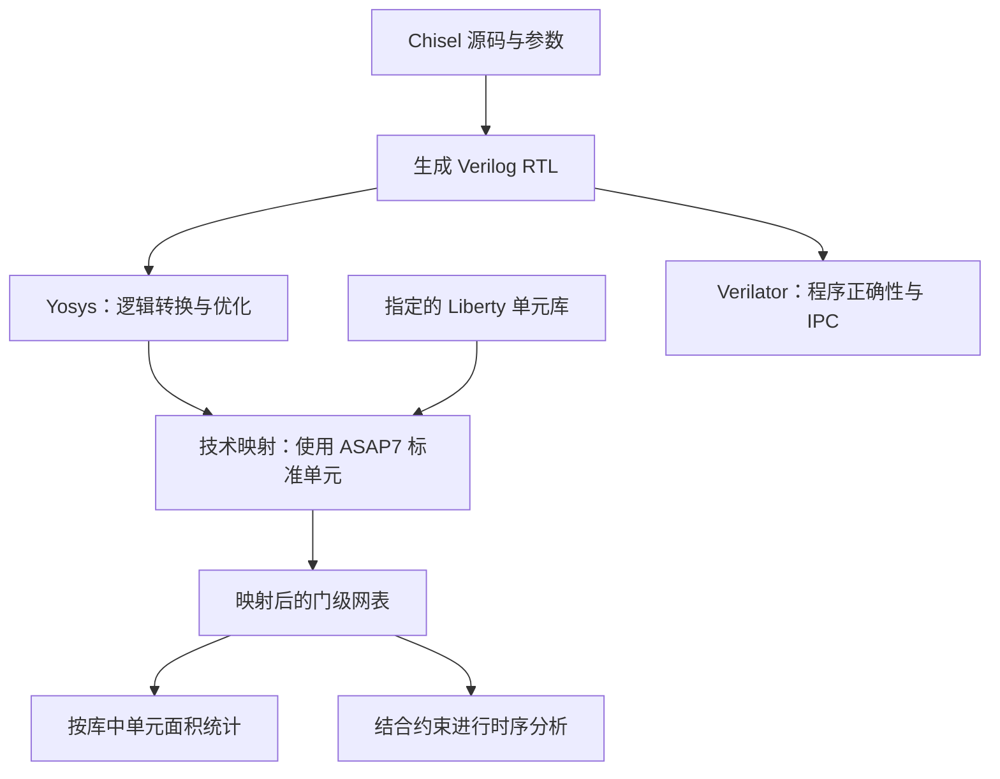

# CPU 关键概念与设计取舍：面积、IPC、频率和 Benchmark

> 配套材料：[项目目标与验收要求](../README.md)。本文用于组会讲解，也作为后续架构实验的参考。
>
> 频率目标为 **300 MHz（3 亿周期／秒）**。提问中的“300 Hz”按笔误处理。
>
> 仓库研究日期：2026-09-20。Benchmark 固定到提交 [`8276763e2a1b45e4543e6250582210d1b0034cb4`](https://github.com/ACMClassCourse-2025/CPU-2026-Benchmark/tree/8276763e2a1b45e4543e6250582210d1b0034cb4)，该提交日期为 2026-09-17。下面的源码结论对应这一版本。

## 1. 先把三个指标放在一起理解

我们用 Chisel 描述硬件结构，生成 Verilog，然后从三个角度评价同一份设计：

| 指标 | 它回答的问题 | 获取方式 | 当前 100 分目标 |
| --- | --- | --- | --- |
| 面积 | 实现这些功能，需要多少硬件资源？ | Yosys 综合并映射到 ASAP7 单元库，再按评测口径统计 | ≤ 40,000，单位待正式规则明确 |
| IPC | 运行指定程序时，平均每个周期完成多少条指令？ | Verilator 仿真，统计完成指令数与周期数 | ≥ 1.0140 |
| 频率 | 硬件每秒可以可靠地运行多少个时钟周期？ | 在指定库、环境和约束下进行时序分析 | ≥ 300 MHz |

在同一统计区间内，设动态完成指令数为 `N`、周期数为 `C`、运行频率为 `f`：

```text
IPC = N / C
执行时间 = C / f = N / (IPC × f)
指令吞吐率 = IPC × f
```

例如，相同程序在 300 MHz、IPC 为 1.1 时，吞吐率为 3.3 亿条指令／秒；在 400 MHz、IPC 为 0.8 时，则为 3.2 亿条指令／秒。提高频率的同时，如果引入太多停顿，程序仍可能变慢。这里的数值是说明概念的假设例子。

课程评分要求面积、IPC 和频率分别达标。即使某个方案的 `IPC × f` 较高，IPC 未达到对应档位仍不能获得该档分数。实际比较运行时间时也要固定程序二进制，避免把指令数变化与硬件改进混在一起。

## 2. 如何理解 Yosys + ASAP7 综合面积

### 2.1 从 Chisel 到标准单元

**综合**是把 RTL（Register Transfer Level）中的寄存器、运算、选择和控制关系转换为硬件网表；**技术映射**是用目标单元库中的具体电路实现这些逻辑。

Yosys 是综合工具。ASAP7 提供预测性的 7 nm 工艺设计资料和标准单元库。标准单元可以理解为实现电路的基本积木，例如与非门、选择器、触发器及不同驱动能力的逻辑门。单元的面积和时序特征由相应库描述。[ASAP7 官方仓库](https://github.com/The-OpenROAD-Project/asap7)



Yosys 的典型库映射流程使用 `dfflibmap` 处理触发器、`abc` 处理组合逻辑；`stat -liberty <库文件>` 可以使用库中的单元面积信息进行统计。正式课程流程可能选用多份库或自定义脚本，应完整复用其配置。[Yosys 单元库映射说明](https://yosyshq.readthedocs.io/projects/yosys/en/latest/using_yosys/synthesis/cell_libs.html)、[Yosys stat 说明](https://yosyshq.readthedocs.io/projects/yosys/en/0.47/cmd/stat.html)

通常，映射后的标准单元面积可以理解为：

```text
标准单元总面积 = Σ（某种单元的实例数量 × 该单元的库面积）
```

这与 Chisel 代码行数、Verilog 文件大小、寄存器位数或门的个数都不能直接画等号。一个 `*` 运算符可能对应很大的乘法电路；一段较长的常量逻辑则可能被综合优化掉。

“综合单元面积”也不直接等于最终芯片占地。布局利用率、布线空间、时钟树以及后续插入的缓冲器等会影响物理实现。课程目前给的是综合评测要求，不能自行将其解释为完整布局布线后的芯片面积。

### 2.2 面积比较要固定哪些条件

不同方案必须使用相同的工具版本、顶层边界、ASAP7 库版本、库变体、综合脚本和时序目标。否则，面积变化可能来自评测配置变化。

ASAP7 的“7 nm”是工艺背景，并不能告诉我们评分表中“40,000”的单位。具体库文件、数值缩放及评分脚本如何读取面积，都要核对。报告中应记录原始面积输出及其单位，避免凭数值大小猜测。

综合结果需要确认关键功能确实保留下来。如果 CPU 输出没有正确连接，或者测试顶层把输入固定为常量，工具可能删除大量逻辑。异常小的面积首先要结合网表、映射警告和功能边界检查。

### 2.3 CPU 内部哪些结构会消耗面积

| 结构 | 面积主要来自哪里 | 增大后的可能收益与限制 |
| --- | --- | --- |
| 流水线寄存器 | 数据、PC、控制信息和有效位的存储 | 增加级数可缩短单级逻辑，但寄存器及恢复控制增加 |
| ALU、乘除法器 | 加法、移位、比较、乘法、除法电路 | 更多单元可减少争用；大组合运算也可能拉长关键路径 |
| 物理寄存器组 PRF | 数据存储、读写端口、译码和选择网络 | 容量缓解寄存器不足；端口决定并行访问能力 |
| ROB | 每条在途指令的完成状态、目的寄存器和恢复等信息 | 容纳更多未提交指令，但不直接增加执行能力 |
| 发射队列 | 指令信息、源操作数标签、就绪判断和选择逻辑 | 扩大可调度窗口，也增加比较和仲裁成本 |
| 旁路网络 | 结果广播、标签匹配、多路选择器 | 减少等待写回的停顿，但连接规模随宽度增大 |
| 分支预测器 | 预测表、目标地址、历史和恢复信息 | 降低控制流停顿；过大结构可能影响取指时序 |
| Cache 与访存队列 | 数据／标签阵列、比较、选择、控制和请求状态 | 减少或隐藏内存等待，但计面积边界需确认 |

以 PRF 为例，64 个 32 位寄存器包含 2,048 位数据存储，但实际成本还包括端口。每周期读取两条双源指令，通常需要总计四个源操作数的读取能力；若只有两个读端口，就要分时、分 bank 或限制发射。增加容量和增加端口是不同的设计选择。

发射队列的唤醒可以近似理解为“队列条目 × 每条指令源数 × 结果广播通道”的标签比较规模。这是判断趋势的粗略模型，实际面积还受编码、共享和综合优化影响。提高发射宽度常会同时扩大寄存器组、队列、旁路和控制逻辑，不能只计算新增 ALU 的成本。

### 2.4 内存不计面积，具体意味着什么

任务明确规定统一内存不计面积，并禁止用寄存器组冒充内存。**这条规则不能自动推导为 PRF、ROB、发射队列和整个 Cache 都不计面积。** Cache 阵列与控制逻辑的具体边界仍需正式评测确认。

Chisel 的不同存储写法还会影响生成硬件的结构：

| Chisel 写法／结构 | 需要理解的含义 |
| --- | --- |
| `Reg(Vec(...))` | 描述寄存器集合；动态索引和多个端口还会产生选择与写入控制逻辑 |
| `Mem(...)` | 异步读、同步写的存储抽象，不能据名称推断最终实现为 SRAM |
| `SyncReadMem(...)` | 同步读写存储抽象；必须在流水线中处理读延迟和读写同址行为 |
| SRAM 宏或课程提供的内存接口 | 需要匹配端口、时序、仿真模型及综合处理规则 |

Chisel 提供存储抽象；最终是否映射到专用存储器还取决于后续流程。Yosys 的 `memory_map` 可以把存储器降为触发器和地址译码逻辑，所以仅写出 `SyncReadMem` 并不保证它会获得课程规定的面积豁免。[Chisel 存储器说明](https://www.chisel-lang.org/docs/explanations/memories)、[Yosys 存储器处理说明](https://yosyshq.readthedocs.io/projects/yosys/en/latest/using_yosys/synthesis/memory.html)

实现时应尽早拿一个小型存储模块跑通正式综合流程，确认存储体如何处理、控制逻辑如何计入。复位策略也要结合实现考虑：许多结构可复位有效位并屏蔽无效数据的读取，不必给每一位数据都加复位电路；前提是满足规定的复位行为和读前初始化要求。

### 2.5 关键 tradeoff：多花面积，换来了什么

| 选择 | 可能得到的收益 | 代价或限制 | 判断依据 |
| --- | --- | --- | --- |
| 复用一个执行单元 | 节省面积 | 请求排队，选择逻辑可能变复杂 | 单元忙碌与结构冲突统计 |
| 增加执行单元 | 更多指令同时执行 | 面积、端口、旁路和布线增加 | 是否有足够独立指令且原单元确实饱和 |
| 迭代乘除法 | 复用小电路，单周期路径较短 | 一次操作占用多个周期 | 相关指令占比、依赖链和单元等待时间 |
| 流水化乘法 | 提高连续乘法的接受速率 | 增加流水寄存器；单次结果仍有延迟 | 乘法吞吐需求是否大于依赖延迟需求 |
| 扩大 ROB／PRF | 增大可保留的在途工作量 | 存储、分配、恢复及选择成本增加 | ROB 满／PRF 空闲项耗尽是否经常发生 |
| 增大 Cache／相联度 | 减少容量或冲突缺失 | 标签比较、命中选择、阵列访问成本增加 | 缺失率下降是否抵消命中延迟和面积增量 |
| 增加流水级 | 缩短关键路径，提升可达频率 | 分支恢复和相关操作延迟可能增加 | 时序改善与实际 IPC 的联合变化 |

## 3. IPC 是什么，如何正确统计

### 3.1 数的是动态完成的指令

IPC 的全称是 Instructions Per Cycle。对于本项目，内部统计建议采用**已提交／退休的架构指令数除以周期数**，最终评分严格对齐课程定义。

“动态”表示实际运行了多少次。例如，一个含 8 条指令的循环执行 100 次，循环部分约有 800 条动态指令。指令在执行单元中计算结束与提交是不同事件：乱序 CPU 可以先计算较新的指令，但通常按程序顺序提交，确保最终可见状态正确。ROB 正是用来跟踪这些在途指令及其完成状态的结构之一。[BOOM ROB 说明](https://docs.boom-core.org/en/latest/sections/reorder-buffer.html)

统计时应注意：

- 错误分支路径上最终被取消的指令不计入提交数，但它们消耗的周期仍会降低 IPC。
- Load、store、分支、跳转和目的寄存器为 `x0` 的合法指令，都可能正常提交；不能仅数寄存器写回次数。
- 流水线气泡不是指令；真正执行并提交的 NOP 则是指令。
- 双提交设计某周期完成两条指令时，计数器应加 2。
- 统计区间内等待内存、资源不足或恢复分支的周期都要计入，不能只数“有指令完成”的周期。

可在测试平台中按照提交接口累计，概念伪代码如下：

```text
每个被纳入统计的 CPU 周期：
    cycles += 1
    retired += 当周期实际提交的架构指令条数

IPC = retired / cycles
```

CSR 指令不作要求，也可以通过 RTL 提交事件与测试平台完成计数。Verilator 将 RTL 转换为可执行的仿真模型，但“哪一条指令算提交”和“在哪个区间统计”仍需要 CPU 接口与评测程序共同定义。[Verilator 官方说明](https://verilator.org/guide/latest/overview.html)

### 3.2 流水线深度、发射宽度和 IPC 的区别

| 概念 | 含义 | 常见误解 |
| --- | --- | --- |
| 流水线深度 | 一条指令经过多少个处理阶段 | 五级流水线不代表 IPC 为 5 |
| 发射宽度 | 每周期最多让多少条指令开始进入相应执行资源；需统一项目内定义 | 双发射不保证 IPC 为 2 |
| 提交宽度 | 每周期最多完成多少条架构指令的提交 | 多个执行单元不能突破单提交的长期上限 |
| 操作延迟 | 发出一个操作到结果可用要等多久 | 延迟较长不一定意味着吞吐率低 |
| 启动间隔 | 同一资源接受连续操作的最小间隔 | 3 周期延迟的流水乘法器可能每周期接收一次新乘法 |

在普通每条架构指令均经过相应阶段的设计中，长期 IPC 会受到取指、译码、分派、发射、执行资源和提交吞吐能力中最紧的限制。队列可以平滑短时波动，不能消除长期带宽不足。

标准单发射、单提交的五级流水线，理想稳态 IPC 上限约为 1；实际还会损失在填充、依赖、分支与访存上。**1.0140 大于 1，因此本组冲刺最高档时，需要具备平均每周期完成超过一条架构指令的能力。**

双发射顺序执行和双发射乱序执行都可作为候选。乱序执行有助于寻找可并行工作，但是否值得其面积和实现成本，应由测试决定。仅增设第二个 ALU，若取指或提交仍长期只有一条／周期，也不足以解决这个目标。

### 3.3 哪些行为会降低 IPC

| 原因 | CPU 中发生了什么 | 本项目应关注的现象 |
| --- | --- | --- |
| 指令供应不足 | I-cache 缺失、取指带宽不足或取指队列为空 | 执行资源有空位但拿不到指令 |
| 真数据依赖 RAW | 后一条需要前一条尚未产生的结果 | Load-use、连续累加、指针追踪 |
| 名字依赖 WAR／WAW | 不同值复用了同一架构寄存器名字 | 在支持乱序的设计中限制可并行执行范围 |
| 分支预测错误 | 已获取或执行的后续指令被清除，重新取指 | 排序、条件选择和函数调用中的控制流损失 |
| 执行资源冲突 | 多条就绪指令争用同一 ALU、LSU 或乘除法器 | 发射队列有就绪项，却不能发射 |
| 数据访问等待 | D-cache 缺失、回填、写缓冲满或内存争用 | 20 周期内存延迟暴露为停顿 |
| 队列或寄存器不足 | ROB 满、发射队列满、物理寄存器用尽 | 前端被迫停止接收指令 |
| 按序提交受阻 | ROB 最老指令未完成，后面的完成结果暂时无法提交 | 短时提交率低，最终可能引发全局背压 |

例如：

```asm
lw   x5, 0(x10)
add  x6, x5, x7     # 依赖上面的 load，必须等数据
add  x8, x9, x11    # 与前两条无寄存器依赖，可成为乱序执行的候选
```

寄存器重命名可以消除 WAR／WAW 这类名字冲突，但不能提前创造 `x5` 的真实数据。第三条提前执行的收益，还取决于发射资源是否可用，以及后续是否有足够独立工作。[BOOM 重命名说明](https://docs.boom-core.org/en/latest/sections/rename-stage.html)

### 3.4 提升 IPC 的方法及适用条件

| 方法 | 解决的问题 | 必须一并考虑的约束 |
| --- | --- | --- |
| 操作数前递／旁路 | 已产生结果的相关指令无需等寄存器写回后再读取 | 旁路选择可能成为关键路径 |
| I-cache + 取指缓冲 | 降低反复访问统一内存的取指成本 | 取指宽度、Cache 行边界、重定向和回填 |
| D-cache | 利用局部性，降低数据访存的平均等待 | 命中延迟、写策略、字节写掩码与缺失处理 |
| 分支预测 + 快速恢复 | 减少控制流停顿与错误路径工作 | 预测表成本、分支解析阶段、恢复正确性 |
| 多发射／多提交 | 利用指令级并行，突破单条／周期的吞吐限制 | 各级带宽、端口和执行单元配套 |
| 动态调度与乱序执行 | 越过等待中的指令，执行后面的独立指令 | PRF、ROB、发射队列、恢复与访存顺序 |
| 合理扩大 ROB／队列／PRF | 避免窗口过小导致前端停顿 | 收益会饱和，不能代替内存带宽和执行资源 |
| 写缓冲及 store-to-load forwarding | 缓解写操作等待，让后续读获得正确的较新数据 | 地址冲突、部分字节覆盖、提交顺序和容量限制 |
| 非阻塞 Cache／多个未完成请求 | 在一次缺失期间继续处理其他访问 | 需要请求跟踪资源及内存接口真实支持并发 |
| 预取 | 在需求到来前提前获得数据或指令 | 可能抢占统一内存带宽、污染 Cache；需实测 |

在乱序设计中，存储副作用必须受到提交／恢复机制约束，不能让错误路径上的 store 修改最终可见的内存状态。旁路也必须匹配地址和字节掩码，不能仅因为“有待写入的数据”就使用它。

### 3.5 用简单模型定位损失

对于一个简化的单发射处理器，可以用以下模型建立直觉：

```text
CPI ≈ 1 + 平均每条指令产生的额外停顿周期
IPC = 1 / CPI

分支额外 CPI ≈ 分支占比 × 误预测率 × 平均误预测惩罚
```

假设分支占比 20%、误预测率 10%、每次损失 5 周期，仅这一项就增加 `0.2 × 0.1 × 5 = 0.1` CPI。若不存在其他损失，IPC 约为 `1 / 1.1 = 0.909`。

这个加法模型只适合解释趋势。乱序、多发射设计中的访存等待、分支恢复和资源冲突可能重叠，不能把所有事件次数乘延迟后直接相加。停顿分析应规定互斥分类，或明确哪些计数器允许重叠。

## 4. 为什么 20 周期内存延迟会影响架构选择

### 4.1 Cache 能减少等待，但必须计算真实回填成本

I-cache 缓存指令，D-cache 缓存数据，利用程序对相邻地址和近期地址的重复访问。两者可以分别提供命中访问，缺失时仍访问课程要求的同一个统一内存。

假设某访问的 Cache 命中耗时 1 周期，缺失在此基础上额外等待 20 周期：

```text
平均访问时间 AMAT = 命中时间 + 缺失率 × 额外缺失代价
缺失率 5%：AMAT = 1 + 0.05 × 20 = 2 周期
缺失率 1%：AMAT = 1 + 0.01 × 20 = 1.2 周期
```

这是教学例子。正式接口中的“20 周期”究竟包含哪些过程，必须按其定义建模；AMAT 也不能直接等同于 CPU 的 CPI，因为一次指令不一定发起一次数据访问，多个等待还可能重叠。

**Cache 行有多个字时，不能默认整行都在 20 周期内返回。** 例如一行 32 字节包含 8 个 32 位字：若内存一次只返回一个字，且必须等待返回后再发下一次请求，完整填充可能需要约 8 次访问；若支持流水请求或宽数据返回，则会不同。应先确定访问宽度和吞吐，再选择行大小。

### 4.2 隐藏延迟需要一组资源共同配合

| 结构 | 能做什么 | 单独增大它不能解决什么 |
| --- | --- | --- |
| ROB | 容纳更多尚未提交的指令 | 不能提供独立指令、内存端口或额外执行单元 |
| 发射队列 | 保存待执行指令，挑选就绪工作 | 不能消除真数据依赖 |
| PRF | 保存更多不同版本的寄存器值 | 不能替代 ROB／队列容量 |
| 缺失请求跟踪项 MSHR | 记录尚未完成的 Cache 缺失 | 内存若仅接受一个在途请求，多项资源不一定产生收益 |
| 写缓冲 | 延后真正写入内存的时刻 | 长期写入速率仍不能超过内存可承受的带宽 |

举例：要在一个 20 周期的等待窗口中以每周期 2 条的速度持续接收工作，量级上需要容纳约 40 条指令，还要有足够独立性、队列空间和其他资源。这只是理解容量与延迟关系的估算，**不能据此断言 40 项 ROB 就足够，或直接选定 ROB 大小**。

对于链式指针访问，“下一次访问地址取决于上一次返回的数据”，扩大 ROB 也难以凭空并行化。对于独立数组循环，可重叠的机会通常更多；最终应看编译后的指令和运行计数器。

## 5. CPU 频率是什么，如何达到至少 300 MHz

### 5.1 频率由一个周期内最慢的有效路径限制

时钟让寄存器在指定边沿更新状态。两次相邻边沿之间，组合逻辑需要把输入计算成足够稳定的输出，以便下一个寄存器正确采样。

```text
时钟频率 f = 1 / 时钟周期 T
300 MHz → T ≈ 3.333 ns

典型寄存器到寄存器路径：
发射寄存器 → 组合逻辑与连线 → 接收寄存器
```

对于普通单周期建立时间检查，预算可以简化为：

```text
T ≥ 发射寄存器 clock-to-Q
    + 组合逻辑延迟
    + 连线延迟
    + 接收寄存器 setup 时间
    + 时钟不确定性及偏斜影响的预算
```

上式将时钟因素合并为预算，实际静态时序分析会按到达时间和要求时间处理偏斜的方向。**关键路径**是最限制时序的路径；它可能位于运算电路，也可能位于仲裁、队列选择或握手控制。

假设某路径组合逻辑为 2.8 ns，其余预算合计 0.7 ns，则需要至少 3.5 ns，最高频率约 285.7 MHz，达不到目标。这个例子说明不能把完整的 3.333 ns 都分配给组合计算。

300 MHz 是周期推进速度，单条指令可以经过多个周期。一个耗时多周期的迭代除法器，只要每周期内的电路满足时序，仍可工作在 300 MHz；它的代价体现在操作延迟与吞吐率上。

### 5.2 为什么 Verilator 仿真成功不能证明频率达标

在测试平台中设定约 3.333 ns 的时钟周期，是给仿真安排边沿。通常的 RTL 仿真不会自动把 RTL 运算变成 ASAP7 标准单元，并计算实际单元与连线传播延迟。

因此需要用综合后的网表、相应时序库和约束进行静态时序分析（STA）。OpenSTA 是一个可用于这种检查的工具，能够读取门级网表、Liberty 时序库、SDC 约束，以及适用时的寄生参数。**课程是否采用它、在哪个物理阶段验收频率，仍以正式流程为准。** [OpenSTA 官方说明](https://github.com/The-OpenROAD-Project/OpenSTA)

完整布局布线后的分析可以纳入更真实的连线影响。若课程只采用综合后的时序估计，我们应报告该阶段的结果，不能将其描述成已经完成芯片物理实现的验证。

### 5.3 Chisel 实现中常见的长路径

| 路径或写法 | 为什么可能变慢 | 改进方向 |
| --- | --- | --- |
| 同周期完成读寄存器、旁路选择、ALU 和再次选择 | 多层逻辑连续串联 | 根据报告划分阶段，减少关键路径选择层数 |
| 唤醒 → 发射选择 → 读操作数 → 执行全部串在一拍 | 比较、优先级选择和运算累积 | 拆分调度阶段或限制每个选择器覆盖的范围 |
| 大型优先级链 | 越靠后的选择可能经过越多级逻辑 | 使用平衡结构、分组仲裁或分 bank，验证综合结果 |
| 对大 `Vec` 动态索引 | 可能形成宽多路选择网络 | 考虑同步存储、分 bank、预译码或流水化 |
| 大组合乘除法 | 一个表达式展开为大量逻辑 | 真正拆分运算，或采用迭代单元 |
| 多级模块组合传递 `ready` | 背压可能穿过许多模块 | 用合适的缓冲切断路径，检查缓冲配置是否仍组合直通 |
| 分支比较后接大规模重定向选择 | 控制路径可能很长、扇出大 | 提前准备目标、简化重定向优先级、合理分级 |
| 全局 flush／stall 信号驱动大量状态 | 高扇出与布线负载增大 | 局部控制、分层传播，必要时调整恢复结构 |

**给表达式结果加一个寄存器，并不自动把表达式内部切成多级流水。** 例如概念写法：

```scala
val product = RegNext(a * b)
```

这里只在乘法结果之后加入寄存器。乘法电路本身仍可能完整位于一个周期内；若它太慢，应采用内部具有寄存器的乘法结构，或把算法分为多个周期执行。这个例子用于说明寄存器边界，不是本项目已选定的乘法器实现。

另一个常见问题是把 Scala 的展开循环当成“每周期做一次”。用于构造电路的 `for` 循环通常会展开硬件；要跨多个周期复用同一组电路，需要显式寄存器、计数器和控制状态。

### 5.4 达到目标需要“设计—分析—修改”的闭环

1. **固定正式评测环境。** 明确 ASAP7 库、工艺／电压／温度条件、时间单位和工具版本，并确认验收使用综合还是布局布线后的时序。
2. **设置完整的时序约束。** 指定时钟、输入／输出延迟及所需负载与不确定性，覆盖 CPU 与外部接口。只有时钟约束还不足以证明所有相关路径都满足要求。
3. **生成 RTL 并完成技术映射。** 确认组合逻辑、触发器及存储接口处理正确，没有遗漏的重要黑盒或非预期锁存器。
4. **读取时序报告。** 找出最差路径的起点、终点、组合逻辑、扇出和延迟来源；先处理实际最限制频率的路径。
5. **修改并复测。** 对该路径分级、减少选择层数或调整资源组织，随后重新验证正确性、IPC、面积和时序。
6. **检查约束覆盖和裕量。** 建立时间、保持时间以及其他适用检查均应通过。所有最终配置都需要单独测量，不能只验证最小配置。

在工具已确认使用 ns 时，时钟约束的形式可以是：

```tcl
# 仅展示时钟约束形式；不是完整的课程时序脚本。
create_clock -name cpu_clk -period 3.333 [get_ports clock]
```

这里的 `clock` 需要替换为实际顶层端口。OpenSTA 的默认单位来自所读取的 Liberty 文件，不能未经核对就把 `3.333` 解释成 ns；尤其需要关注所用 ASAP7 文件和流程是否进行了单位缩放。[OpenSTA 单位说明](https://openroad.readthedocs.io/en/latest/main/src/sta/doc/Examples.html)

建立时间报告中的 slack 可理解为“要求到达时间 − 实际到达时间”。负 slack 表示相应路径不满足约束；WNS 是最差裕量，TNS 用于汇总负裕量。不能仅凭没有负 WNS 就宣布通过，还要检查是否存在未约束路径或被错误排除的路径。

同样，综合工具的延迟目标只是优化要求，不能代替最终时序检查。Yosys 的 `abc -D` 可设置映射延迟目标，但它本身不是完整的时序签核。[Yosys ABC 说明](https://yosyshq.readthedocs.io/projects/yosys/en/0.47/cmd/abc.html)

设计早期可留出合理裕量，例如以约 3.0 ns 为内部探索目标，再按正式 300 MHz 约束验收。裕量需要结合面积成本决定。不能通过给普通路径随意添加 false-path／multicycle 例外来“消除”违规；多周期操作也应由真实硬件协议和正确约束支持。

## 6. 对给定 Benchmark 仓库的研究

### 6.1 当前仓库实际包含什么

指定版本包含六个单线程 C 测试点、相应数据，以及 `common/` 轻量支持头文件；`common.original/` 保留了原始 RISC-V 裸机支持文件。本次查看的文件中没有完整的 CPU Verilator 评测平台、Yosys + ASAP7 面积脚本或六项 IPC 的正式汇总公式。[仓库说明](https://github.com/ACMClassCourse-2025/CPU-2026-Benchmark/blob/8276763e2a1b45e4543e6250582210d1b0034cb4/README.md)

下表的算法和规模来自源码；“可能的瓶颈”是架构分析推断，必须通过最终 RV32 二进制和 RTL 仿真验证。

| 测试点 | 源码中的工作与规模 | 可能的性能瓶颈 | 优先观察的设计因素 |
| --- | --- | --- | --- |
| `vvadd` | 300 个元素，逐项计算两个数组之和 | 连续读取、写入带宽，load-use 依赖 | D-cache、LSU 吞吐、写缓冲、旁路和双发射配对 |
| `median` | 400 个元素的三点中值滤波 | 数据相关比较／分支，邻近数据反复读取 | 分支预测、D-cache 局部性、load-use 停顿 |
| `multiply` | 100 对输入；源码用 32 轮移位与条件加法实现乘法 | 循环与条件分支、整数依赖链 | I-cache、预测、整数 ALU 与调度 |
| `qsort` | 2,048 个整数；快速排序，小区间转插入排序 | 数据相关分支、交换和访存依赖 | 预测准确率、D-cache、访存与执行的重叠 |
| `rsort` | 2,048 个无符号整数；每轮处理 8 位、256 个桶 | 桶读改写、数组扫描、间接写入和依赖 | Cache／LSU、store-to-load forwarding、地址生成 |
| `towers` | 7 个圆盘；递归求解，使用链表结构 | 调用返回、栈访问、链式地址依赖 | 返回地址预测、I/D-cache、load-use 延迟 |

源码依据：[vvadd](https://github.com/ACMClassCourse-2025/CPU-2026-Benchmark/blob/8276763e2a1b45e4543e6250582210d1b0034cb4/vvadd/vvadd_main.c)、[median](https://github.com/ACMClassCourse-2025/CPU-2026-Benchmark/blob/8276763e2a1b45e4543e6250582210d1b0034cb4/median/median.c)、[multiply](https://github.com/ACMClassCourse-2025/CPU-2026-Benchmark/blob/8276763e2a1b45e4543e6250582210d1b0034cb4/multiply/multiply.c)、[qsort](https://github.com/ACMClassCourse-2025/CPU-2026-Benchmark/blob/8276763e2a1b45e4543e6250582210d1b0034cb4/qsort/qsort_main.c)、[rsort](https://github.com/ACMClassCourse-2025/CPU-2026-Benchmark/blob/8276763e2a1b45e4543e6250582210d1b0034cb4/rsort/rsort.c)、[towers](https://github.com/ACMClassCourse-2025/CPU-2026-Benchmark/blob/8276763e2a1b45e4543e6250582210d1b0034cb4/towers/towers_main.c)。数组规模定义在各测试点的 `dataset1.h`，`towers` 的圆盘数定义在其主程序中。

以 32 位 `int` 计算，`vvadd` 内核处理的三个数组合计约 3.6 KB，`median` 的输入与输出合计约 3.2 KB；这些数字不包含验证数据、栈及其他状态。小规模工作集提示 Cache 可能有效，但不能据此直接确定 Cache 容量：映射冲突、冷启动、验证阶段是否计时，以及代码与栈的访问都会影响结果。

### 6.2 `multiply` 不能直接当作硬件乘法器性能测试

`multiply/multiply.c` 的核心算法逐位检查乘数，条件累加，并移动两个操作数，共循环 32 次。因而，从源码看，它主要测试软件乘法过程。编译器最终是否产生 `MUL`、产生多少，仍需检查反汇编。

这意味着本组不能看到名字就决定增加多个硬件乘法器。应先统计最终程序中的乘除法指令比例，再决定乘法器吞吐和除法器延迟的投入。与此同时，任务要求的 M 扩展指令仍必须完整实现，不能以这六个测试点较少使用为由省略。

### 6.3 当前 `setStats()` 没有实际计数作用

`common/util.h` 中的 `setStats(int enable)` 是空操作，`printArray()` 也是空操作，`PREALLOCATE` 默认值为 0。因此，源码中的 `setStats(1)` 与 `setStats(0)` 不能自动形成可供 CPU 识别的计时边界，优化后这些调用可能完全消失。[当前 util.h](https://github.com/ACMClassCourse-2025/CPU-2026-Benchmark/blob/8276763e2a1b45e4543e6250582210d1b0034cb4/common/util.h)

源码中还保留了可选的预运行逻辑。正式统计需明确是冷 Cache 还是预热后的 Cache，以及是否包含启动、初始化、结果检查和退出过程；不能自行把预热移出计时区间来替代课程定义。

六个测试点的汇总方法也需要确认。下面两种公式一般不相等：

```text
各程序 IPC 的算术平均 = (IPC1 + IPC2 + ... + IPC6) / 6
汇总指令数与周期数的比值 = (N1 + N2 + ... + N6) / (C1 + C2 + ... + C6)
```

例如两个程序都提交 1,000 条指令，分别耗时 1,000 和 4,000 周期，其 IPC 为 1 和 0.25；算术平均是 0.625，总指令数除以总周期数则是 0.4。未拿到正式汇总口径前，应保存每项原始 `N`、`C` 和 IPC。

### 6.4 顶层 Makefile 保留了旧配置，不能视为现成 RV32IM 评测入口

当前 Makefile 默认 `XLEN=64`，默认 ISA 参数是 `-march=RV64IMAFDXhwacha`，还引用了已经不在当前仓库中的若干测试目录，以及 `common/test.ld` 等文件。故不能直接照搬默认 `make` 作为本项目构建方式。[当前 Makefile](https://github.com/ACMClassCourse-2025/CPU-2026-Benchmark/blob/8276763e2a1b45e4543e6250582210d1b0034cb4/Makefile)

对接课程构建时，应统一 RV32 目标、ABI、优化等级、启动代码、链接布局与终止协议；常见 RV32IM 配置是 `-march=rv32im -mabi=ilp32`，但这两个选项并不能单独保证符合本项目的全部豁免范围：完整 RV32I 仍包含本任务不要求的字节／半字加载等指令，支持库也可能引入额外需求。

因此需要对最终 ELF 做反汇编核查，并使用课程认可的运行时。`common.original/` 的历史启动／计数代码包含 CSR 访问，不能直接假设它适用于本项目规定的精简指令范围。[原始启动代码](https://github.com/ACMClassCourse-2025/CPU-2026-Benchmark/blob/8276763e2a1b45e4543e6250582210d1b0034cb4/common.original/crt.S)、[原始计数代码](https://github.com/ACMClassCourse-2025/CPU-2026-Benchmark/blob/8276763e2a1b45e4543e6250582210d1b0034cb4/common.original/syscalls.c)

### 6.5 `rsort` 的原子内建函数需要确认如何适配

`rsort/rsort.c` 多处使用 `__sync_fetch_and_add` 更新桶。这是编译器原子操作内建函数；目标无法直接实现时，编译器可能生成外部辅助函数调用。它能否仅用要求的 RV32IM 子集构建、辅助函数是否存在，必须检查实际工具链和链接结果。[rsort 源码](https://github.com/ACMClassCourse-2025/CPU-2026-Benchmark/blob/8276763e2a1b45e4543e6250582210d1b0034cb4/rsort/rsort.c)、[GCC 原子内建函数说明](https://gcc.gnu.org/onlinedocs/gcc/_005f_005fsync-Builtins.html)

RV32IM 不包含 A 原子扩展。不能为构建方便擅自切换到 RV32IMA，也不能自行修改评分程序的原子操作后就假定结果仍符合官方评测。应确认课程将提供兼容二进制、支持函数还是认可的源码适配方式。单线程是适配时可利用的条件，但具体方式应统一。

### 6.6 本次做了什么验证

本次在主机上使用 GCC 13.3.0，以 `-std=gnu99 -O2 -DPREALLOCATE=0 -DHOST_DEBUG=0`，配合当前 `common/` 和对应测试目录，分别编译运行了全部六项，**退出码均为 0，程序自检通过**。

这验证了当前 C 测试点能在本地主机环境运行。尚未对它们执行 RV32 交叉编译，也没有 CPU RTL 可用于测量 IPC、面积或频率。上述瓶颈分析属于源码推断，文中所有用于讲解的性能数字均不是本项目实测成绩。

## 7. 面向本组目标的设计探索顺序

**建议先建立可信的测量闭环，再围绕观测到的瓶颈增加硬件。** 以下是候选探索顺序，不预先承诺某个参数组合一定达到 100 分。

| 步骤 | 要完成的工作 | 主要决策依据 |
| --- | --- | --- |
| 1. 接通评测 | 确认 RV32 程序、统一内存接口、提交计数、综合与时序配置 | 能否对同一配置得到可复现的正确性、IPC、面积、时序结果 |
| 2. 建立正确基线 | 完成指定指令、旁路、停顿和分支恢复 | 正确性阶段全部通过；20 周期内存下瓶颈可解释 |
| 3. 改善指令与数据供应 | 评估 I-cache、D-cache、取指缓冲、写缓冲 | 缺失率、统一内存争用、前端断供及访存停顿 |
| 4. 评估双宽流水线 | 配套取指、译码／分派、执行和提交能力 | 双发射利用率、端口争用、面积与时序变化 |
| 5. 评估乱序与预测 | 增加动态调度、重命名／ROB，改进分支预测 | 是否能越过长等待并获得足够独立工作；错误预测损失是否显著 |
| 6. 扫描参数并收敛 | 调整 PRF、ROB、队列、Cache 和单元配置 | 在面积与频率同时达标的条件下，达到或超过 IPC 门槛 |

阶段之间可以交叉实验。例如，若双宽顺序设计已经接近目标，应先判断其主要损失；若主要来自分支错误，优化预测可能比扩大乱序窗口更有效。若取指常因内存等待中断，增加 ALU 往往不能解决问题。

初步参数实验可以考虑发射宽度 `{1, 2}`、PRF 数量 `{48, 64, 96}`、ROB 条目 `{16, 32, 64}`。这些只是候选取值，需由所选结构的合法性和综合结果筛选；PRF 和 ROB 实验适用于实际采用相应结构的方案。每次比较应固定其他相关参数，最终再做必要的组合实验。

建议每个测试点至少记录下列数据：

| 数据 | 用途 |
| --- | --- |
| 提交指令数、周期数、IPC、验证结果 | 建立评分数据的基础 |
| 每周期提交 0／1／2 条的次数 | 判断多提交能力是否被实际利用 |
| 前端断供、ROB 满、PRF 耗尽、发射队列满 | 找出容量与供给瓶颈 |
| I/D-cache 访问和缺失、回填周期、内存请求等待 | 区分命中率、带宽和排队问题 |
| 分支数、误预测数、恢复周期 | 量化预测与流水线深度的影响 |
| 执行单元忙碌、就绪却无法发射、提交端等待 | 判断应增加资源还是降低依赖延迟 |
| 映射面积、时序阶段、约束、WNS／其他检查结果 | 判断同一硬件配置是否满足面积和频率 |

计数器可以主要放在测试平台，或按课程允许方式加入仿真观测逻辑，避免无意中把大量调试硬件计入被评分的 CPU。观测方式不能改变被测 CPU 的行为。

## 8. 组会讲解顺序与需要落实的问题

建议按下列顺序讲解，约 15–20 分钟，细节可根据讨论展开：

1. 用第 1 节解释三项指标，以及为什么它们必须同时满足。
2. 用第 2 节解释 Chisel 如何变成有面积和延迟的真实电路，重点讲端口、旁路和存储实现成本。
3. 用第 3、4 节解释 IPC 的计数方式、依赖与停顿，以及 20 周期统一内存为何需要认真设计访存路径。
4. 用第 5 节解释 3.333 ns 预算和时序报告，明确频率需要工具结果支撑。
5. 用第 6 节介绍六个测试点及已发现的构建／计数问题，再讨论第 7 节的实验优先级。

对接评测环境时，优先落实以下四组问题：

| 类别 | 需要明确的内容 |
| --- | --- |
| 程序与计数 | 是否提供 ELF／镜像、统计起止点、冷／热 Cache、六项 IPC 汇总方式、`rsort` 原子内建函数适配 |
| 统一内存 | 地址空间、数据宽度、端口、握手、20 周期定义、请求吞吐与并发、字节写掩码 |
| 综合面积 | 顶层边界、ASAP7 库与脚本、单位／缩放、内存与 Cache 各部分的计入方式 |
| 频率 | 验收阶段、PVT 条件、时钟及接口约束、存储宏时序模型、是否考虑布线寄生 |

这些问题的答案应记录在项目文档中，并成为后续所有方案对比的共同条件。
