# CPU 复杂结构硬件设计指南：从五级流水线到双发射与 Cache

> 面向熟悉 C++、刚学 Chisel 的 ParaRisc 项目组。本文讲设计与实现思路，不要求先读懂一个完整开源 CPU。
>
> 前置阅读：[Chisel 零基础速通](chisel-crash-course.md)。项目约束见 [README](../README.md)，旧模拟器迁移见 [迁移文档](simulator-to-chisel-design.md)。
>
> 图中电路是教学设计，配置数字是算例。课程内存接口、存储面积口径和最终微架构仍以项目正式约定为准。

本项目宽度 2 候选实现的具体端口数量、冲突处理及 IPC 检查见 [端口预算](port-budget-and-ipc.md)；本文中的通道数和 Cache 组织示例以教学说明为主。

## 0. 阅读地图与图例

本文沿着一条问题链展开：**一条指令怎样走过电路 → 多条怎样并行 → 如何调整资源规模 → 慢运算怎样分拍 → 慢内存怎样缓存 → 整机怎样避免丢数据和错误提交。**

| 章节 | 要解决的问题 | 最后应能自己画出什么 |
| --- | --- | --- |
| [1. 设计语言与接口](#s1) | “硬件实现”究竟要明确什么 | 寄存器、选择器、数据线与控制线 |
| [2. 五级流水线](#s2) | 指令怎么重叠、何时停顿与旁路 | 五级数据通路和冒险处理 |
| [3. 多发射](#s3) | 如何每拍处理两条而不破坏依赖 | 双通道、重命名、选择和提交 |
| [4. 参数化](#s4) | 改宽度为什么不是改一个常量 | 位宽公式、端口与资源约束 |
| [5. 乘法器](#s5) | 乘法如何在面积和延迟间取舍 | 移位累加、压缩树、真正流水化 |
| [6. 除法器](#s6) | 除法如何每拍算出一位商 | 余数、减法器与商移位寄存器 |
| [7. I-cache 与 D-cache](#s7) | 地址如何变成命中或回填 | Tag 比较、数据选择、写回控制 |
| [8. 统一内存与访存顺序](#s8) | I/D 怎么共享内存、store 何时生效 | 仲裁器、在途请求和写缓冲 |
| [9. 顶层集成](#s9) | 长延迟、背压、flush 如何协调 | 请求、完成、恢复三套连接 |
| [10. 验证与实施顺序](#s10) | 怎样确定功能、面积和性能真的改善 | 模块测试、提交对拍和参数实验 |

图采用 Mermaid，可在支持 Mermaid 的 Markdown 阅读器中直接渲染；局部电线图采用纯文本，即使不渲染也能读。它们是 RTL 层的逻辑连接图，不是晶体管级原理图或布局布线图。

```text
[REG]                 保存状态，时钟边沿更新
(组合逻辑)             当前输入决定当前输出，没有跨拍记忆
[MUX]                 多路选择器，由控制信号决定选哪一路
===== 32b =====>       一组 32 位并行数据线
----- 1b ------>       一根控制线
ready <-------        接收方把接收能力传回发送方
```

Mermaid 图中实线通常表示数据/事务流，虚线表示控制、使能或反馈；图上有名称和宽度的箭头优先按标注理解。时钟、复位未逐一画出，默认所有寄存器属于同一个时钟域。信号交接发生在 `valid && ready` 为真的采样边沿。

<a id="s1"></a>
## 1. 把一个软件功能翻译成硬件，需要回答六个问题

拿 C++ 的 `result = a * b` 举例，数学表达式只回答了“结果是什么”。硬件还需要回答：

1. **输入**：a、b 从哪个端口来，各几位，带不带符号？
2. **状态**：需要保存操作数、中间结果、目的寄存器和指令身份吗？
3. **资源**：有几个加法器、读端口、写端口、乘法器？
4. **时间**：第几拍接收、第几拍完成、下一条最早何时能进入？
5. **冲突**：下游不接收、两个结果同时完成时，谁等待、数据存哪里？
6. **取消**：分支恢复后，旧指令的结果还能否写入状态？

### 1.1 数据通路与控制通路

一个带使能的累加器可以拆成下面的电线：

```text
                         +-------------------------------+
                         |                               |
                         v                               |
input ===== 32b =====> [加法器] ===== 32b =====> [MUX] --> [ACC REG]
                         ^                      ^          |
                         |                      |          |
                         +-------- ACC ---------+----------+
                                                |
                             enable ----- 1b ----+

MUX 的两路数据输入：ACC 当前值、ACC + input
enable=0 选当前值；enable=1 选相加结果；时钟边沿写入 ACC。
```

`ACC`、加法器、MUX 构成数据通路；`enable` 的生成逻辑属于控制通路。Chisel 的一行 `when(enable) { acc := acc + input }` 背后就包含这种结构。

### 1.2 延迟与启动间隔必须分别写

| 实现 | 延迟举例 | 启动间隔 II 举例 | 表示什么 |
| --- | --- | --- | --- |
| 组合 ALU 接一个结果寄存器 | 1 拍 | 1 拍 | 每拍可接一条 |
| 三段乘法流水线 | 3 拍 | 1 拍 | 同时容纳不同阶段的三条运算 |
| 32 步迭代除法器 | 32 个迭代拍，另计握手开销 | 约 32 拍或更长 | 同一组硬件反复处理一条指令 |
| 单在途内存接口 | 20 拍响应延迟 | 至少受事务完成限制 | 不代表每拍能接新请求 |

本文的具体模块会标出接收边沿和最早响应边沿，避免把内部迭代数直接当成接口延迟。电路可能同时有低吞吐、高延迟，也可能高吞吐、高延迟。

### 1.3 CPU 内部请求必须携带“它是谁”

乘除法器、Load 单元常常在很多拍之后完成，只有结果数据是不够的：

```text
执行请求：{ op, srcA, srcB, pdst, robSlot, generation }
执行响应：{ data, pdst, robSlot, generation, error }
```

`pdst` 是目的物理寄存器，`robSlot` 是 ROB 槽号，`generation` 用于区分槽位复用。顺序五级核可以采用更小的元信息；乱序核要保证响应准确对应仍在途的动态指令。

下面所有算术核心只演示数值与握手；接入 CPU 时，必须让这些元信息与数据一起寄存、一起停顿、一起判定是否有效。

<a id="s2"></a>
## 2. 五级流水线：先把一条通道设计完整

### 2.1 五级各做什么

| 阶段 | 名称 | 主要组合工作 | 需要交给下一级的内容 |
| --- | --- | --- | --- |
| IF | 取指 | PC 选择、取指请求/接收 | PC、指令、预测信息、有效位 |
| ID | 译码 | 指令分类、立即数生成、寄存器读取 | 操作数、控制码、rd、PC |
| EX | 执行 | ALU、地址计算、分支比较 | 运算结果/地址、store 数据、控制 |
| MEM | 访存 | Load/Store 与 D-cache 交互 | Load 结果或 ALU 结果、rd |
| WB | 写回 | 选择最终写回值、更新寄存器堆 | 架构可见的结果 |

这是教学上的功能划分，不能理解为任何指令固定五拍完成。I-cache miss、D-cache miss、迭代除法都可能让某一级停留多拍。Sodor 提供带旁路或全互锁的五级教学核，可作为结构阅读材料；本文图不是其逐线复刻。[Sodor 官方说明](https://chipyard.readthedocs.io/en/1.5.0/Generators/Sodor.html)

### 2.2 五级总数据通路

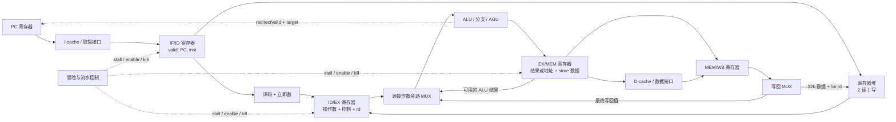

四个级间寄存器把组合逻辑分隔开。每个寄存器保存的是一个**指令包**，不能只寄存数据而让 `rd`、`memWrite`、`valid` 在别的时序上前进。

### 2.3 没有冒险时，流水线如何重叠

```text
周期          1    2    3    4    5    6    7
指令 A       IF   ID   EX  MEM   WB
指令 B            IF   ID   EX  MEM   WB
指令 C                 IF   ID   EX  MEM   WB
```

一条指令穿过五级，理想填满后每拍完成一条。它提高的是吞吐，不是把每条指令的所有工作都压成一拍。单发射、单提交的五级核适合作为正确性基线，但在通常 IPC 定义下，不能达到本项目 `IPC >= 1.0140` 的目标。

### 2.4 旁路：给操作数多接几条线

考虑：

```asm
add x5, x1, x2
sub x6, x5, x3
```

`sub` 需要 x5 时，`add` 的结果可能已经算出，但还没写回寄存器堆。与其一直等待，可以从较后阶段把结果接回 EX 输入。

```text
ID/EX.rs1Value ===== 32b =====\
EX/MEM.aluResult === 32b =====> [3:1 MUX] === 32b ===> ALU 输入 A
MEM/WB.wbValue ===== 32b =====/     ^
                                   |
EX/MEM.rd == ID/EX.rs1 -----\       | 选择控制
MEM/WB.rd == ID/EX.rs1 ------> [优先级逻辑]
各阶段 valid / writesRd ----/
```

对于顺序流水线，EX/MEM 比 MEM/WB 更年轻，若它们都写同一个寄存器，应优先取 EX/MEM 中**对应的最新生产者**。但若这个最新生产者是尚未返回数据的 Load，不能绕过去取更老的 MEM/WB 值：此时必须停顿。

核心判断可以这样拆开，代码是模块内部示意：

```scala
val exMatch = exMem.valid && exMem.writesRd &&
  (exMem.rd =/= 0.U) && (exMem.rd === idEx.rs1)
val wbMatch = memWb.valid && memWb.writesRd &&
  (memWb.rd =/= 0.U) && (memWb.rd === idEx.rs1)

val srcABlocked = idEx.usesRs1 && exMatch && !exMem.resultReady
val srcA = Mux(exMatch && exMem.resultReady, exMem.result,
  Mux(wbMatch, memWb.result, idEx.rs1Value))
// srcABlocked 时禁止该指令向执行单元交接；不能使用 srcA 的候选值执行。
```

同样的网络通常需要为源 B、分支比较操作数、store 数据提供适当旁路。`usesRs1/usesRs2` 来自译码，避免把立即数字段误当成真实寄存器依赖。

### 2.5 Load-use：旁路也不能传递尚不存在的数据

```asm
lw  x5, 0(x1)
add x6, x5, x2
```

假设 D-cache 命中在 MEM 阶段末才能得到数据，且不把“存储器输出再穿过 ALU”塞进同一拍，则需要一个气泡：

```text
周期          1    2    3    4    5    6    7
lw           IF   ID   EX  MEM   WB
add               IF   ID   ID   EX  MEM   WB
EX 中的气泡                  --
```

在周期 3 检测到 ID 依赖 EX 中的 Load 后：保持 PC 和 IF/ID；让 Load 继续前进；把下一拍的 ID/EX 置为无效。若 Load miss，等待会更长，不能固定等一拍就放行。

**保持与气泡不同**：保持是同一条指令留在原级；气泡是该级下拍没有有效指令。直接把所有流水寄存器都停住，会连那个应该前进并解除依赖的 Load 也卡住。

### 2.6 每一级的三种动作：替换、保持、清空

一般的弹性流水槽可以写成：

```scala
// 片段：slot 是寄存器，in/out 为同类型的 Decoupled 接口。
val canAccept = !valid || io.out.ready
io.in.ready := canAccept && !io.kill
io.out.valid := valid && !io.kill
io.out.bits := slot

when (io.kill) {
  valid := false.B
}.elsewhen (canAccept) {
  valid := io.in.valid
  when (io.in.valid) { slot := io.in.bits }
}
```

`kill` 同时抑制当拍输出交接，防止已被判定取消的指令在边沿产生副作用。这里假设 kill 来自独立的恢复控制，不经 `out.fire` 绕回形成组合环；真正接入时仍要检查控制依赖。

对 Load-use 的“ID 保持、EX 注入气泡”，需要在 ID→EX 交接资格中加入 hazard 条件；并非把 hazard 当成上述 `kill`，否则会把需要稍后继续执行的指令删掉。

### 2.7 分支、PC 和清空范围

若分支在 EX 判定错误预测，IF 和 ID 中比它年轻的指令应清除，较老的 MEM/WB 指令继续完成。重定向 PC 选择通常为：

```text
复位入口 / 已确认的恢复目标 / 正常下一 PC
                         ↓
                    [PC 选择 MUX] → PC 寄存器
```

已发出的错误路径取指请求未必能撤销，要给响应带路径身份或有效性判断。收到旧响应可以丢弃其取指交付，但仍应完成外部协议握手，不能让内存响应永久堵住。

顺序核若让迭代 MDU 阻塞 EX，可先获得简单、精确的程序顺序；若允许更年轻指令越过，便需要额外的完成排序和架构提交机制，不能只把 EX 的 stall 去掉。

<a id="s3"></a>
## 3. 多发射：从一条通道到两条通道

### 3.1 “双发射”不是所有地方各复制一份

| 宽度 | 含义 | 不足时发生什么 |
| --- | --- | --- |
| 取指宽度 | 每拍供应多少条指令的字节 | 后端吃不饱 |
| 译码/重命名/分派宽度 | 每拍接纳多少条新指令 | 指令窗口补充太慢 |
| 发射宽度 | 每拍向执行单元交接多少条 | 就绪指令积压 |
| 写回宽度 | 每拍接收多少个结果 | 完成结果排队 |
| 提交宽度 | 每拍按程序顺序确认多少条 | ROB 排空太慢 |

这几种宽度可以不同。两条 ALU 通道不等于双提交；双取指也不代表两条指令都能执行。多发射与乱序是独立维度：顺序核也能双发射，乱序核也可能每拍只发射一条。

### 3.2 先理解双发射顺序核

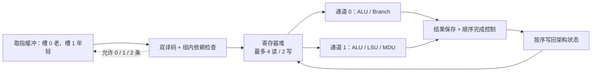

这是候选资源分配，不是必须采用的通道安排。初版可以规定每拍最多一个访存、一个分支，依赖同组前一条结果时只发射第一条。

```asm
add x5, x1, x2     # 槽 0
xor x6, x3, x4     # 槽 1：独立，可一起发射
```

```asm
add x5, x1, x2     # 槽 0
xor x6, x5, x4     # 槽 1：依赖槽 0，初版延后
```

不要默认第二个 ALU 在同一拍拿到第一个 ALU 结果；那会引入“ALU0 → 旁路 MUX → ALU1”的串联路径。顺序发射下，槽 0 不能执行时一般不允许槽 1 越过它；选择年轻就绪项越过老项，需要配套乱序状态管理。

长延迟单元导致完成先后改变时，要么保守地停住后续指令，要么保存结果并按序确认，防止 WAR/WAW 和错误路径副作用。

### 3.3 双发射乱序核的骨架

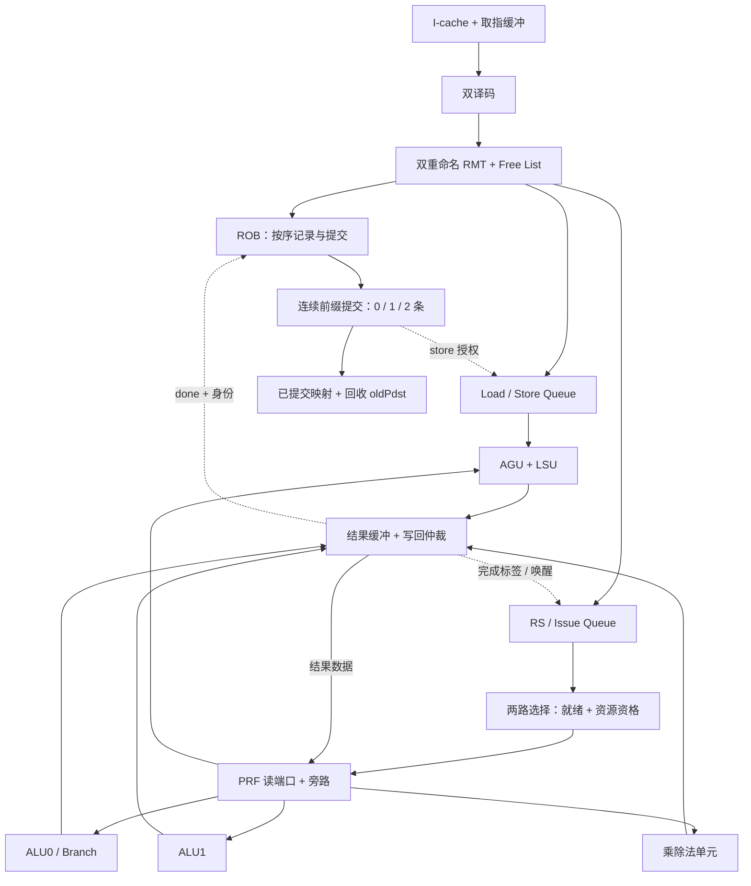

图中的多条执行支路不表示每拍全能发射。选择器必须同时满足总宽度、各类单元接受能力、PRF 读端口和写回策略的约束。

### 3.4 双重命名的关键：同组依赖必须走旁路

假设初始 `RMT[x5]=p9`，两条新指令分别分配 `p40`、`p41`：

```asm
add x5, x1, x2    # I0：新目的 p40，旧目的 p9
sub x5, x5, x3    # I1：源 x5 应是 p40，新目的 p41，旧目的也应是 p40
```

```text
RMT[x5] = p9 -----------\
                        > [源映射 MUX] ----> I1.psrc1 = p40
I0.newPdst = p40 -------/          ^
                                  |
I0.writesRd && I0.rd == I1.rs1 ----+

RMT[I1.rd] ------------\
                        > [旧目的 MUX] ----> I1.oldPdst = p40
I0.newPdst -------------/          ^
                                  |
I0.writesRd && I0.rd == I1.rd ------+
```

完成这组分派后 `RMT[x5]=p41`。未来 I0 提交释放 p9，I1 提交释放 p40；不能让两条都记录旧映射 p9，也不能提交时释放自己的 `newPdst`。

任意宽度 W 时，第 j 条的每个源要在更老的槽 `0..j-1` 中找**最近的写同名寄存器者**。两源比较数量约为 `W(W-1)`，还没算目的旧映射更新。RMT、Free List 与同组旁路的职责可参考 [BOOM 重命名设计](https://docs.boom-core.org/en/latest/sections/rename-stage.html)。

### 3.5 分派是一个事务，接收数量必须一致

若只有一项 ROB 空位，即使 RS 有四项、Free List 有十项，也不能分派两条。对每条指令计算它需要的资源，然后选择能完整接收的**连续前缀**。

```text
accept0 = slot0.valid && enoughResourcesFor0
accept1 = accept0 && slot1.valid && enoughResourcesAfter0For1
accepted = 0、1 或 2
```

对不写目的寄存器的分支/store，不应无条件扣一个物理寄存器；对访存指令需要扣相应 LSQ 容量。只有最终决定接收的槽才允许修改 RMT、Free List、ROB 尾指针和各队列状态。

不能把两条输入简单变成完全独立的 `Decoupled` 握手，允许槽 1 被消费而槽 0 留下，同时又宣称分派保持程序顺序。可以定义 `acceptCount`，或明确约束各槽 ready 的前缀关系。

### 3.6 两路发射选择：第二路要排除第一路

```text
每项 eligible[i] = valid[i] && srcReady1[i] && srcReady2[i]

eligible & ALU0 支持的类型 ------> 仲裁 0 ----> selected0
eligible & ALU1 支持的类型
         & ~selected0_onehot ----> 仲裁 1 ----> selected1
```

只有请求实际 `fire` 才从 RS 移除；若选中了但执行单元不 ready，就要保留条目。固定下标优先便于实现，但可能饥饿；最老优先有利于推进阻塞前端/提交的老指令，代价是年龄选择逻辑。见 [BOOM Issue Unit](https://docs.boom-core.org/en/latest/sections/issue-units.html)。

类型约束还会影响利用率：若通道 0 能做 ALU 和分支、通道 1 只能做 ALU，应避免通道 0 抢走唯一可给通道 1 的 ALU，而把已就绪分支留着。可以先给稀缺功能选请求，再分配通用请求，或设计联合选择逻辑。

### 3.7 多端口 PRF 和旁路为什么贵

双发射、每条两源，最直接的实现需要最多 4 个读端口。若有 B 路写回数据，每个读源都可能需要 B 个 tag 比较和一个 `(B+1):1` 数据 MUX。

```text
PRF 读数据 -------------------\
写回口 0：data/tag -------------> [源 0 的旁路 MUX] ---> 执行输入 0
写回口 1：data/tag ------------/
             tag 匹配 + valid ----^

这一组网络还要为其他源操作数重复。
```

对 N 项、每项两源的 RS，B 路广播的直接唤醒网络约有 `2 × N × B` 个 tag 比较器。扩大 N、B 不只增加存储位，也增加连线、选择器、扇出和关键路径。[BOOM 寄存器堆与旁路](https://docs.boom-core.org/en/latest/sections/reg-file-bypass-network.html)

### 3.8 双提交：只提交队首连续的完成项

```text
head.done=0, head+1.done=1  → 提交 0 条
head.done=1, head+1.done=0  → 提交 1 条
head.done=1, head+1.done=1  → 最多提交 2 条，还要满足副作用资源条件
```

分支恢复、异常边界、已提交 store 缓冲容量都可能截断前缀。两条写同一架构寄存器时，提交映射最终应保留较年轻那条的映射；资源回收必须逐条处理。

ROB 的核心职责是允许结果乱序完成，同时让架构状态按程序顺序前进。每条至少要跟踪有效性、完成状态、目的信息和必要的异常/恢复信息。[BOOM ROB 说明](https://docs.boom-core.org/en/latest/sections/reorder-buffer.html)

<a id="s4"></a>
## 4. 参数化：生成一族合法电路

### 4.1 参数分为三类

| 类别 | 例子 | 是否改变生成的硬件 |
| --- | --- | --- |
| 结构参数 | 发射宽度、ROB 项数、PRF 项数、Cache 相联度 | 是 |
| 算法/组织选择 | 迭代乘法或流水乘法、替换策略、端口分配 | 是，常改变时序和接口能力 |
| 仿真条件 | 内存响应延迟、测试程序、随机背压 | 主要改变环境；不能伪装成 CPU 优化 |

`case class` 保存参数只是第一步。索引、计数、选择器、队列接收数量、测试都必须由参数一致地派生。

### 4.2 一份有明确支持范围的配置

```scala
import chisel3._
import chisel3.util._

case class CoreParams(
  issueWidth: Int = 2,
  commitWidth: Int = 2,
  physRegs: Int = 64,
  robEntries: Int = 24,
  rsEntries: Int = 12,
  cacheBytes: Int = 4096,
  lineBytes: Int = 32,
  ways: Int = 1
) {
  private def powerOfTwo(x: Int): Boolean = x > 0 && (x & (x - 1)) == 0

  require(Set(1, 2).contains(issueWidth))
  require(Set(1, 2).contains(commitWidth))
  require(physRegs >= 32 + issueWidth)
  require(robEntries >= math.max(issueWidth, commitWidth))
  require(rsEntries >= issueWidth)
  require(powerOfTwo(lineBytes) && lineBytes >= 8)
  require(Set(1, 2).contains(ways))
  require(cacheBytes > 0 && cacheBytes % (lineBytes * ways) == 0)

  val sets: Int = cacheBytes / (lineBytes * ways)
  require(sets >= 2 && powerOfTwo(sets))

  val pregBits: Int = math.max(1, log2Ceil(physRegs))
  val robIndexBits: Int = math.max(1, log2Ceil(robEntries))
  val robCountBits: Int = log2Ceil(robEntries + 1)
  val offsetBits: Int = log2Ceil(lineBytes)
  val indexBits: Int = log2Ceil(sets)
  val tagBits: Int = 32 - offsetBits - indexBits
  require(tagBits > 0)
}
```

这里**明确只支持宽度 1/2、直接映射/二路相联**，不是声称任意配置都已实现。`physRegs >= 32 + issueWidth` 是本示例为至少一组新目的预留空间的约束，不代表足够获得目标性能。正式项目应让 I-cache、D-cache 各有一份独立参数。

### 4.3 指针位宽、计数位宽和非法编码

| 用途 | 编码范围 | 位宽公式 | 例子 |
| --- | --- | --- | --- |
| ROB 槽号 | 0..N-1 | `ceil(log2 N)` | N=24，需要 5 位 |
| ROB 占用数 | 0..N | `ceil(log2(N+1))` | N=32，需要 6 位 |
| 物理寄存器号 | 0..P-1 | `ceil(log2 P)` | P=48，需要 6 位 |
| 当拍接收条数 | 0..W | `ceil(log2(W+1))` | W=2，需要 2 位 |

N=24 的 5 位槽号还能编码 24..31，但这些不是合法地址。不能把截断当成模 N 回卷。

```scala
// 模块内部辅助函数：ptr 合法，amount 在 0..2，depth >= 2。
def advanceByAtMostTwo(ptr: UInt, amount: UInt, depth: Int): UInt = {
  val indexBits = math.max(1, log2Ceil(depth))
  val sum = ptr +& amount
  val wrapped = Mux(sum >= depth.U, sum - depth.U, sum)
  wrapped(indexBits - 1, 0)
}
```

因为最多前进 2，且 depth≥2，最多减一次 depth 即可。若推广到任意 amount，需要重新证明范围。环形 ROB 的新老判断也不能直接用数值 `slotA < slotB`；应结合头指针的环形距离或可靠的序号。

### 4.4 同拍释放与分配，先定义账本

```text
nextCount = count + accepted - committed
```

是否允许本拍提交空出的 ROB 槽立即被分派复用，有两种设计：

- **保守**：分派只看本拍开始时的 free 数，下一拍才利用释放；控制简单。
- **前递**：把本拍确定提交的数量加入可分配资源；利用率更好，但增加提交到分派的组合路径。

两者都可以正确，所有资源模块要采用一致的交接契约。计算使用足够宽的中间数，并验证 `0 <= nextCount <= depth`；不要先让窄加法溢出，再做减法。

### 4.5 每增加一个参数，都写出代价

| 参数增大 | 可能收益 | 典型成本/限制 |
| --- | --- | --- |
| 发射宽度 | 更多独立指令并行 | 读端口、同组依赖、选择、旁路同时增长 |
| ROB 项数 | 容纳更多在途指令 | 存储、年龄逻辑、恢复耗时 |
| PRF 项数 | 降低无空闲物理寄存器停顿 | 数据阵列、地址译码、tag 宽度 |
| RS 项数 | 找到更多就绪指令 | 唤醒比较与发射选择路径 |
| Cache 容量 | 降低容量缺失 | 阵列与访问延迟，不保证冲突缺失都改善 |
| 相联度 | 降低映射冲突 | 多路 Tag 比较、数据 MUX 和替换状态 |
| MDU 展开度 | 减少迭代次数 | 单拍组合逻辑变长或复制更多单元 |

<a id="s5"></a>
## 5. 乘法器：从竖式乘法到流水线

### 5.1 先确定要返回哪一半、怎样解释符号

RV32 的乘法结果最多需要 64 位：

| 指令 | 操作数解释 | 返回 |
| --- | --- | --- |
| MUL | 低位结果对有/无符号解释相同 | 乘积 `[31:0]` |
| MULH | 有符号 × 有符号 | 乘积 `[63:32]` |
| MULHSU | 有符号 rs1 × 无符号 rs2 | 乘积 `[63:32]` |
| MULHU | 无符号 × 无符号 | 乘积 `[63:32]` |

除法指令的符号与边界规则在第 6 节列出。这些是 ISA 要求，与内部使用多少周期无关。[RISC-V M 扩展规范](https://docs.riscv.org/reference/isa/v20240411/unpriv/m-st-ext.html)

### 5.2 二进制乘法就是“选择若干个移位后的 A 相加”

若 B 的各位是 `b0..b31`：

```text
A × B = (b0 ? A : 0)
      + (b1 ? A << 1 : 0)
      + ...
      + (b31 ? A << 31 : 0)
```

例如 `13 × 11`，11 的二进制是 `1011`：

```text
          00001101       13
        × 00001011       11
        ----------
          00001101       13 << 0
          00011010       13 << 1
          00000000       第 2 位为 0
        + 01101000       13 << 3
        ----------
          10001111       143
```

这些行称为部分积。硬件设计的主要区别，是让它们**分拍累加**，还是**并行生成并压缩**。

### 5.3 方案一：逐位移位累加，复用一个加法器

保存四个状态：64 位累加器 P、64 位被乘数移位寄存器 M、32 位乘数寄存器 Q、剩余步数。

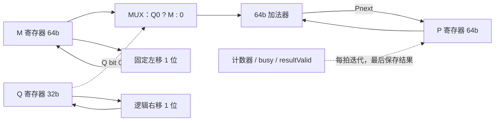

固定移一位通常就是改变连线位置，不需要一个任意移位量的桶形移位器。每拍的主要计算路径是加法器及其输入选择。

以 4 位无符号 `13 × 11` 为例，P/M 用 8 位保存：

| 迭代前步号 | P | M | Q | Q0 | 本步后的 P |
| ---: | ---: | ---: | ---: | ---: | ---: |
| 0 | 0 | 13 | 11 | 1 | 13 |
| 1 | 13 | 26 | 5 | 1 | 39 |
| 2 | 39 | 52 | 2 | 0 | 39 |
| 3 | 39 | 104 | 1 | 1 | 143 |

### 5.4 一份完整的无符号迭代核心

以下模块可放进 Scala 工程，顶部需要 `import chisel3._` 和 `import chisel3.util._`。它输出完整的 `2*width` 位乘积，支持结果背压，**不含 CPU tag、flush 或符号包装**。

```scala
class IterativeUMul(width: Int = 32) extends Module {
  require(width >= 2)
  private val countBits = log2Ceil(width + 1)

  val io = IO(new Bundle {
    val req = Flipped(Decoupled(new Bundle {
      val a = UInt(width.W)
      val b = UInt(width.W)
    }))
    val resp = Decoupled(UInt((2 * width).W))
  })

  val busy = RegInit(false.B)
  val resultValid = RegInit(false.B)
  val acc = Reg(UInt((2 * width).W))
  val shiftedA = Reg(UInt((2 * width).W))
  val remainingB = Reg(UInt(width.W))
  val left = Reg(UInt(countBits.W))
  val result = Reg(UInt((2 * width).W))

  io.req.ready := !busy && !resultValid
  io.resp.valid := resultValid
  io.resp.bits := result

  when (io.resp.fire) {
    resultValid := false.B
  }

  when (io.req.fire) {
    acc := 0.U
    shiftedA := io.req.bits.a
    remainingB := io.req.bits.b
    left := width.U
    busy := true.B
  }

  when (busy) {
    val addend = Mux(remainingB(0), shiftedA, 0.U((2 * width).W))
    val nextAcc = acc + addend
    acc := nextAcc
    shiftedA := (shiftedA << 1)(2 * width - 1, 0)
    remainingB := remainingB >> 1
    left := left - 1.U

    when (left === 1.U) {
      result := nextAcc
      resultValid := true.B
      busy := false.B
    }
  }
}
```

时序定义：请求在 E0 接收；E1 做第 1 步；E32 做第 32 步，并在 E32 之后令响应有效；接收方 ready 时，响应最早在 E33 交接。该简化核心不支持“送出旧结果同时接收新请求”，因此下一请求最早在 E34 接收。内部是 32 步，接口交接间隔还含控制开销。

注意最后一步写 `result := nextAcc`，不能写旧的 `acc`；否则会漏掉最后一个部分积。背压期间结果与有效位一直保留，不能只拉高一拍脉冲。

### 5.5 如何复用无符号核心完成所有乘法符号组合

有两种容易实现的方法：先求绝对值再对完整乘积恢复符号；或者先算无符号乘积，再修正高半部分。这里推导第二种。

令 `Au`、`Bu` 是输入的无符号解释，`sa/sb` 表示“这个操作数按有符号解释且最高位为 1”：

```text
A = Au - sa × 2^32
B = Bu - sb × 2^32

A × B = Au×Bu - sa×Bu×2^32 - sb×Au×2^32 + sa×sb×2^64
```

只保留低 64 位时，最后一项可丢弃。这说明低 32 位不变，高 32 位需要减去对应的修正项。

```scala
// 模块内部片段：a、b 为 32 位 UInt；unsignedProduct 为 64 位乘积。
// signedA/signedB 由 MULH/MULHSU/MULHU 控制码产生。
val negA = signedA && a(31)
val negB = signedB && b(31)
val correctionA = Mux(negA, Cat(b, 0.U(32.W)), 0.U(64.W))
val correctionB = Mux(negB, Cat(a, 0.U(32.W)), 0.U(64.W))
val corrected = unsignedProduct - correctionA - correctionB
val low = corrected(31, 0)
val high = corrected(63, 32)
```

`MULHSU` 只允许 rs1 被解释为有符号，不能把两个输入都 `.asSInt`。操作数和 signed 标志要在请求接收时保存，不能在 32 拍后重新读取已经变化的输入端口。修正的两级减法也占组合延迟，必要时增加独立结果修正级。

例如 `0xffffffff × 2`：MULHU 的高半是 1；把 rs1 解释为 -1 时，MULHSU 的高半为 `0xffffffff`，低半都为 `0xfffffffe`。

### 5.6 方案二：并行部分积与进位保存压缩

最直接的并行乘法器同时生成所有部分积。若把 32 个部分积串联相加，会形成很长的进位传播路径。

进位保存加法器 CSA 把三个数压成两个数，当前层不把进位一路传播到最高位：

```text
每个 bit i 的全加器：

x[i] ---\
y[i] ----> [全加器 FA] ----> sum[i]      权重仍为 2^i
z[i] ---/             \---> carry[i+1]  权重变为 2^(i+1)

按向量写：
sum   = x XOR y XOR z
carry = ((x AND y) OR (x AND z) OR (y AND z)) << 1
x + y + z = sum + carry       # 用足够宽的向量保留进位
```

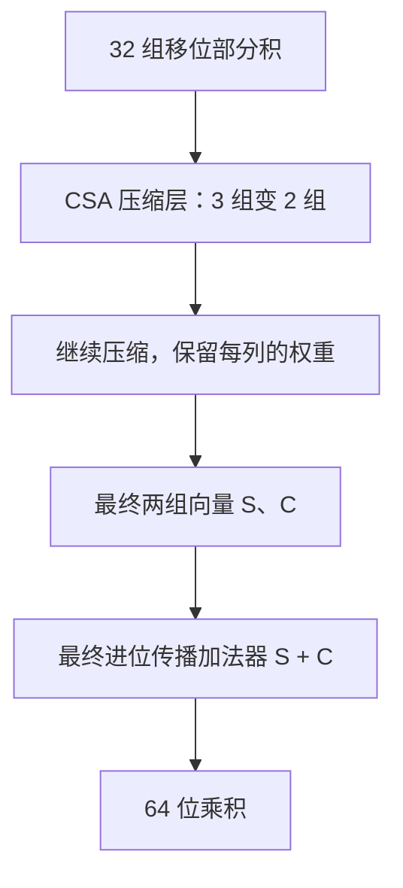

Wallace/Dadda 树是组织压缩层的常见方法；Booth 重编码则通过使用 `0、±A、±2A` 等选择减少部分积数量。这些优化还涉及符号扩展、负部分积修正和列宽管理，建议在基础版本与验证模型稳定之后再做。

### 5.7 真正流水化：在乘法的内部工作之间放寄存器

下面的代码只给输出增加延迟：

```scala
val product = io.a * io.b
val delayed = RegNext(RegNext(product))
```

完整乘法仍在第一个寄存器之前。若该乘法组合路径不能满足时钟，后面再接多少个寄存器也不自动把它切开。

一个容易手工理解的 32×32 无符号三段方案是分成四个 16×16 部分乘积：

```text
A = Ahi×2^16 + Alo
B = Bhi×2^16 + Blo

P00 = Alo×Blo       P01 = Alo×Bhi
P10 = Ahi×Blo       P11 = Ahi×Bhi
P = P00 + (P01 << 16) + (P10 << 16) + (P11 << 32)
```


先将部分积零扩展到足够宽，再移位和相加，U/V 用 64 位保存。这个方案确实把不同的算术工作分到了三个阶段；但 16×16 乘法或 64 位加法是否满足 300 MHz，仍要综合与时序验证。

可以先使用全流水统一停顿：最后一级有效且下游不 ready 时，全部级寄存器保持，并拉低输入 ready；否则各级前移一格。后续再用各级弹性缓冲提高局部空位利用率。每级都要带 `valid`、操作码和 tag。

无背压、持续输入时可做到 II=1；这意味着三级中同时有不同指令，取消机制也必须逐条判断，不能只有一个全局 busy 位。

### 5.8 为 ParaRisc 比较哪些方案

| 方案 | 适合作为什么 | 要测什么 |
| --- | --- | --- |
| 逐位迭代 | 面积较小的功能基线 | 乘法依赖链与密集乘法吞吐 |
| 每拍处理多位 | 在迭代与全并行之间折中 | 展开后单拍路径和面积 |
| 内部分段流水 | 乘法密集程序的性能候选 | II、实际时序、结果端口压力 |

向量乘法程序可能让单迭代单元成为瓶颈，但“换流水乘法器”也需要足够的源读取和写回带宽。可以阅读 [Rocket MulDiv 源码](https://github.com/chipsalliance/rocket-chip/blob/master/src/main/scala/rocket/Multiplier.scala) 看成熟实现如何组织状态、展开参数和结果控制，不必第一版就照搬全部优化。

<a id="s6"></a>
## 6. 除法器：每拍确定一位商

### 6.1 先做无符号，再包装符号与边界

对于非零除数 D，目标是得到：

```text
N = Q × D + R
0 <= R < D
```

纸上长除法每次拿下一位、比较、能减就减并写一个商位。硬件可以复用一个减法器，每拍决定一位商。这里采用逐位试减的恢复余数思路；当试减为负时用 MUX 保留未减的值，无需真的再加回一次。

### 6.2 状态与连接

保存除数 D、余数 R、商/尚未处理的被除数 Q、剩余步数。开始时 `R=0, Q=N`。

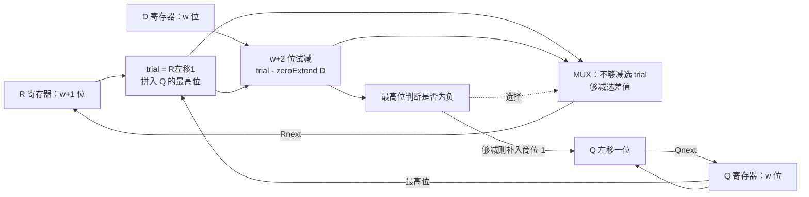

每拍核心方程：

```text
trial = (R << 1) | Q最高位
take  = trial >= D
Rnext = take ? trial - D : trial
Qnext = (Q << 1) | take
```

每次成功选择后，新的余数仍小于 D，所以对正常迭代有不变量 `0 <= R < D`。w 次迭代后，Q 原先的被除数位全部被新的商位替换。

### 6.3 手算 4 位的 13 / 3

| 步号 | 迭代前 Q | 迭代前 R | trial | 是否减 3 | 新 R | 新 Q |
| ---: | --- | ---: | ---: | --- | ---: | --- |
| 0 | `1101` | 0 | 1 | 否 | 1 | `1010` |
| 1 | `1010` | 1 | 3 | 是 | 0 | `0101` |
| 2 | `0101` | 0 | 0 | 否 | 0 | `1010` |
| 3 | `1010` | 0 | 1 | 否 | 1 | `0100` |

最终商为 `0100=4`，余数为 1。中间 Q 同时存“还未处理的被除数位”和“已经形成的商位”，这就是它看起来并非单调变化的原因。

### 6.4 一份完整的无符号迭代核心

代码与乘法核心一样采用保守的一次一个请求、响应可背压接口。除零直接给出规定的无符号商余数。

```scala
class UDivResult(width: Int) extends Bundle {
  val quotient = UInt(width.W)
  val remainder = UInt(width.W)
}

class IterativeUDiv(width: Int = 32) extends Module {
  require(width >= 2)
  private val countBits = log2Ceil(width + 1)

  val io = IO(new Bundle {
    val req = Flipped(Decoupled(new Bundle {
      val dividend = UInt(width.W)
      val divisor = UInt(width.W)
    }))
    val resp = Decoupled(new UDivResult(width))
  })

  val busy = RegInit(false.B)
  val resultValid = RegInit(false.B)
  val divisor = Reg(UInt(width.W))
  val q = Reg(UInt(width.W))
  val r = Reg(UInt((width + 1).W))
  val left = Reg(UInt(countBits.W))
  val resultQ = Reg(UInt(width.W))
  val resultR = Reg(UInt(width.W))

  io.req.ready := !busy && !resultValid
  io.resp.valid := resultValid
  io.resp.bits.quotient := resultQ
  io.resp.bits.remainder := resultR

  when (io.resp.fire) {
    resultValid := false.B
  }

  when (io.req.fire) {
    when (io.req.bits.divisor === 0.U) {
      resultQ := ((BigInt(1) << width) - 1).U(width.W)
      resultR := io.req.bits.dividend
      resultValid := true.B
    }.otherwise {
      divisor := io.req.bits.divisor
      q := io.req.bits.dividend
      r := 0.U
      left := width.U
      busy := true.B
    }
  }

  when (busy) {
    // 正常迭代中 R < D < 2^width，因此 R 的最高冗余位恒为 0。
    val trial = Cat(r(width - 1, 0), q(width - 1)) // width+1 位
    val diff = Cat(0.U(1.W), trial) - divisor.pad(width + 2)
    val take = !diff(width + 1)
    val nextR = Mux(take, diff(width, 0), trial)
    val nextQ = Cat(q(width - 2, 0), take)

    r := nextR
    q := nextQ
    left := left - 1.U

    when (left === 1.U) {
      resultQ := nextQ
      resultR := nextR(width - 1, 0)
      resultValid := true.B
      busy := false.B
    }
  }
}
```

`diff` 多留一位，将无符号试减结果放在足够宽的模运算空间中。被减数和减数范围受控，最高位为 1 表示负差；不能对任意截断后的减法都套用这个规则。

正常 width=32 请求在 E0 接收，E1..E32 迭代，响应最早 E33 交接。除零分支在 E0 后就有效，最早 E1 交接；上层必须允许可变延迟。结果使用 `nextQ/nextR`，避免漏最后一步。

### 6.5 有符号 DIV/REM 包装

符号处理分为请求前处理和结果后处理：

```text
signN = signedOp && N[31]
signD = signedOp && D[31]
absN  = signN ? (~N + 1) : N       # 32 位无符号幅值
absD  = signD ? (~D + 1) : D

先算 absN / absD → qAbs, rAbs
Q = (signN XOR signD) ? -qAbs : qAbs
R = signN ? -rAbs : rAbs
```

`0x80000000` 的正幅值是 2³¹，能放入 32 位 UInt；不要先塞进 32 位正 SInt 再求绝对值。最终符号恢复按 32 位补码截断。

以下情况必须优先处理，不能让普通符号恢复覆盖它们：

| 情况 | 商 | 余数 |
| --- | --- | --- |
| 任意 N 除以 0 | `0xffffffff` | 原始 N 的位模式 |
| 有符号 `0x80000000 / 0xffffffff` | `0x80000000` | 0 |
| 普通有符号除法 | 向零截断 | 非零余数符号与 N 相同 |

例如 `-13 / 3 = -4`，余数 -1；`13 / -3 = -4`，余数 +1。不能直接依赖 C++ 的除零或最小负数除以 -1 来构造参考答案；应先分支处理 ISA 边界。[M 扩展除法定义](https://docs.riscv.org/reference/isa/v20240411/unpriv/m-st-ext.html)

`DIV/DIVU` 选择商，`REM/REMU` 选择余数。同一次内部除法能产生两者，但合并相邻的两条指令还需要两套目的信息和完成记录，第一版不必做融合。

### 6.6 除法优化的合理顺序

先保证逐位算法与握手正确，再考虑零/一/幂次除数早出、跳过前导零、每拍多位商和更复杂的非恢复/SRT 算法。每种早出都会改变延迟，需要保留身份并通过同一响应协议完成。

不要把一组 32 次的 Scala `for` 直接写成组合依赖链，以为它会变成 32 拍；那可能一次生成 32 层试减电路。**迭代共享单元依赖寄存器反馈和步数计数，Scala 循环只负责展开结构。**

<a id="s7"></a>
## 7. I-cache 与 D-cache：地址、数组、比较器和状态机

### 7.1 Cache 缓存的是“行”，不只是一个字

Cache line 是一次存储和替换的基本数据块。例如一行 32 字节，包含 8 个 32 位字；CPU 要其中一个字，Cache 会用地址先定位整行，再选出那个字。

一行至少有：

```text
valid：这一行是否装有有效内容
tag：这一行对应哪个内存地址范围
data：完整的一行数据
dirty：数据是否比下级内存新；写回型 D-cache 需要
```

I-cache 主要服务取指，通常只读，不需要 CPU store 的脏位管理。D-cache 处理 load/store，需要考虑字节掩码、脏行、读写冲突和程序顺序。

### 7.2 直接映射 Cache 的地址拆分

以 **4 KiB 数据容量、32 B 行、直接映射、32 位字节地址** 为例：

```text
行数 / sets = 4096 / 32 = 128
行内偏移 offset = 5 位
组索引 index = 7 位
tag = 32 - 5 - 7 = 20 位

地址位： 31                  12 11           5 4        2 1       0
        +----------------------+---------------+----------+---------+
        |      tag：20 位       | index：7 位   | 字号 3 位 | 字节 2位 |
        +----------------------+---------------+----------+---------+
```

“4 KiB”只计算数据阵列；Tag、valid、dirty、替换状态和控制逻辑还会增加面积。地址位域确定后，写代码时应直接由参数派生切片边界。

### 7.3 命中通路的实际电线

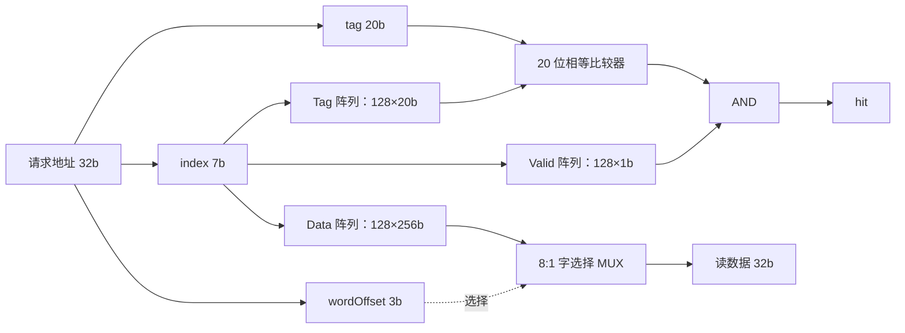

这不是一个 C++ 哈希表查询。每个框都要落实成阵列、比较器或选择器；“index 一样”只表示候选位置相同，还必须检查 tag 和 valid。

例如地址 `0x00001024`：行基址 `0x00001020`，index=1，tag=1，字偏移=1，字节偏移=0。地址 `0x00000024` 也落在 index=1，但 tag=0；直接映射下两者不能同时占据该行。

### 7.4 同步阵列会改变命中时序

如果数据阵列使用 `SyncReadMem`，读地址在边沿采样，结果在之后的周期可用。请求的 tag、字偏移、事务身份必须同步保存，才能与返回的阵列数据对应。

```text
周期 C0：接受 CPU 地址，向阵列送 index
边沿 E0：阵列采样地址，同时锁存 tag / offset / 请求身份
周期 C1：获得阵列数据，比较 tag，形成命中结果或 miss 决策
边沿 E1：若 ready，交付命中响应；否则锁存响应并等待
```

不能把前一请求的数据与当前输入端口的新地址比较。若阵列继续接受新请求，旧响应遭到背压时也必须有缓冲，防止被后续读结果覆盖。首版可采用一次只处理一个 CPU 请求的 blocking Cache，简化这部分状态。

Chisel 对同步存储器的读使能和同址读写有明确语义；默认行为不能替代所需的旁路或端口仲裁。[Chisel Memories](https://www.chisel-lang.org/docs/explanations/memories)

### 7.5 二路相联：一个 index 给出两个候选位置

保持 4 KiB/32 B，改为二路相联：`sets=64`，index=6 位，offset=5 位，tag=21 位。

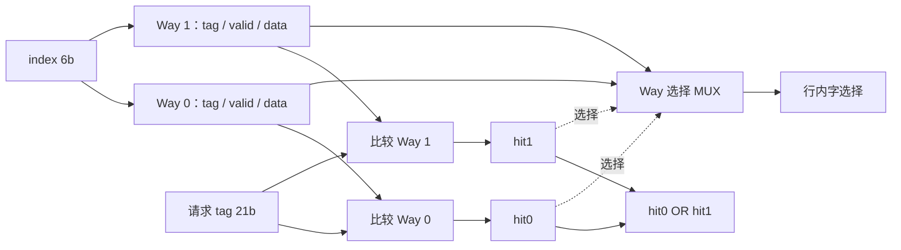

无命中时选 victim：优先用无效 way，否则按替换策略选择。二路可以用每组一位记录最近使用情况。应保证同一组不会出现两份有效且 tag 相同的重复行，测试中可检查命中 one-hot。

相联度增加能减少某些冲突缺失，但会增加 Tag 比较和数据 MUX，不能只看 miss rate，不看命中延迟和面积。

### 7.6 I-cache 的第一版控制器

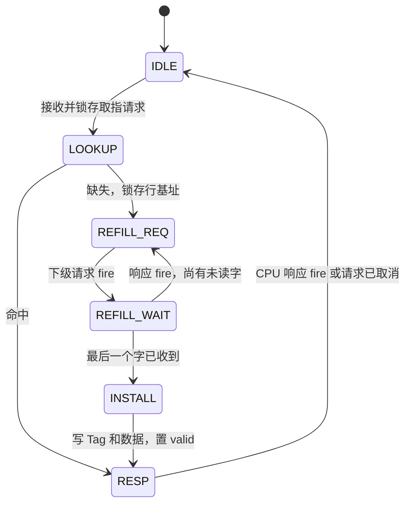

至少需要保存：原始 PC、行基址、index/tag、已接收字数、回填缓冲、响应数据、请求身份。锁存后，状态机使用这些寄存器，而不是一直读取变化中的 CPU 地址输入。

`REFILL_REQ` 状态必须保持请求有效和地址，直到下级 ready；`REFILL_WAIT` 不能把同一个请求每拍重发。收到响应再增加 beat 计数，发送请求时增加和接收响应时增加属于不同账本。

首版在整行填满后才置 valid。若要提前返回关键字或边收边提供命中，需要每字有效性、未完成回填跟踪等额外状态，不能提前把整行标为有效。

### 7.7 双指令取指：8 字节的带宽从哪里来

本项目 RV32IM 指令按 4 字节讨论，不加入压缩指令。双取指每拍最多需要相邻的两条指令，共 8 字节。

| 存储组织 | 怎样提供两条 | 需要注意 |
| --- | --- | --- |
| 一次读整行 | 从 256 位中选两个相邻 32 位字 | 宽读阵列和两个字选择器的成本 |
| 64 位读口 | 读取包含两条的块 | PC 可能处于 64 位块的后半，需要拼接/缓冲 |
| 按字奇偶分 bank | 相邻字通常落到不同 bank | 两路地址、bank 次序、跨行处理 |

若 PC 的行内偏移是 28，第二条位于下一行。首版可只返回第一条有效，下一次请求取第二条；取指缓冲根据有效条数推进 PC。不能从当前行数组越界读出“下一条”。

两条取回后还要检查控制流：若第一条分支被预测跳走，第二条顺序指令可能不应进入有效路径；后续恢复机制仍要处理预测错误。

### 7.8 D-cache 的写策略先选清楚

两个维度不要混在一起：

| 维度 | 选择 | 行为 |
| --- | --- | --- |
| 命中写策略 | write-through，写穿 | 更新 Cache，同时把写操作送向下级 |
| 命中写策略 | write-back，写回 | 更新 Cache 并置 dirty，替换/排空时写下级 |
| store miss 分配 | write-allocate，写分配 | 先取回整行，再合并写入 |
| store miss 分配 | no-write-allocate，不写分配 | 直接向下级写，不装入本级 |

写穿控制相对直观，但 20 周期慢内存下可能需要写缓冲来避免每个 store 都堵住。写回能合并对同一行的多次写，但必须正确处理脏行替换、最终排空和程序可见性。

下面详细讲一种教学候选：**blocking、write-back、write-allocate**。选它不代表它已经是 ParaRisc 最终方案。

### 7.9 Store 数据路径：字节掩码控制哪些线更新

采用小端、32 位数据端口，`byteMask(0)` 控制最低字节：

```text
CPU store data 32b ----> 按 addr[1:0] 对齐移位 ----> 写入字节 0..3
CPU store size -------> 生成 4 位 byteMask --------> 每字节写使能

oldWord byte0 -----\
newWord byte0 ------> [MUX，mask0] ---> 保存的 byte0
oldWord byte1 -----\
newWord byte1 ------> [MUX，mask1] ---> 保存的 byte1
... byte2、byte3 同理
```

```scala
// 模块内部片段：已确认本次访问不跨 32 位字，storeData 为原始源寄存器。
val shifted = storeData << Cat(byteOffset, 0.U(3.W)) // 左移 8*offset
val alignedData = shifted(31, 0)
val bytes = Wire(Vec(4, UInt(8.W)))
for (i <- 0 until 4) {
  bytes(i) := Mux(byteMask(i), alignedData(8 * i + 7, 8 * i),
    oldWord(8 * i + 7, 8 * i))
}
val mergedWord = bytes.asUInt
```

| 操作 | 合法对齐算例 | byteMask | 数据放置 |
| --- | --- | --- | --- |
| SB | offset=2 | `0100` | 源低 8 位写入目标字节 2 |
| SH | offset=2 | `1100` | 源低 16 位写入高半字 |
| SW | offset=0 | `1111` | 写整个字 |

`SB/SH/SW` 都在当前项目需要支持的范围内。未对齐访问是否需要支持应按课程接口确认；若要支持跨字/跨行，需要拆请求和合并结果，不能简单截断掩码假装完成。

如果存储器原语支持字节写使能，可以直接生成对应掩码端口；否则采用读改写时要锁定/仲裁该行，防止丢掉另一笔并发更新。

### 7.10 D-cache miss：脏 victim 必须先保存到下级

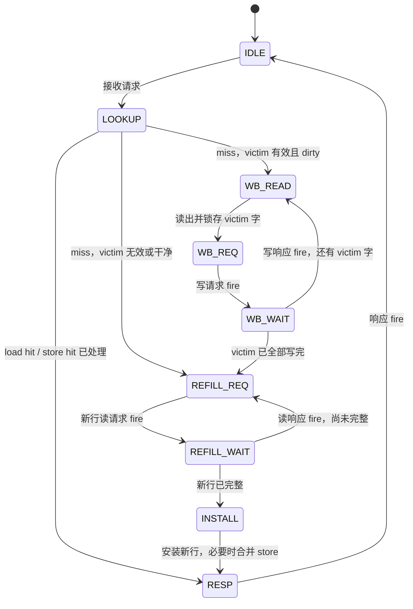

需要锁存两类地址：

```text
victimBase = {旧 tag, 当前 index, 全零 offset}
refillBase = {请求 tag, 当前 index, 全零 offset}
```

写回必须用旧 tag 重建的地址；若用当前缺失请求地址，会把旧数据写坏到新行的位置。直到旧数据排空之前，也不能覆盖 victim 的 Tag/数据。

store miss 取回整行后，把 store 的字节掩码应用一次，再置 dirty。若控制器选择“回填后重放原请求”，则不要在安装阶段再额外执行一次有外部副作用的 store。状态机要统一到底在哪个事件算这次 store 完成。

### 7.11 Cache 控制器需要哪些状态寄存器

| 状态 | 保存什么 | 为什么不能只读输入端口 |
| --- | --- | --- |
| pendingRequest | 地址、类型、数据、mask、请求 ID | CPU 在请求 fire 后可改变输入 |
| victim | way、旧 tag、dirty、必要的数据 | 回填过程中目标阵列可能变化 |
| refillBeat | 已接收多少字、当前地址 | 多拍响应必须定位到正确位置 |
| lineBuffer | 未安装完整的新行 | 防止把半行当完整命中 |
| response | 数据/完成状态、ID、valid | 下游可能背压 |
| state | LOOKUP/写回/回填/响应 | 约束端口使用和状态转移 |

数据阵列端口也要列预算：若每 way 只有一个读写端口，CPU 命中访问、victim 读出、回填写入不能同拍任意进行。blocking 首版可以让缺失期间不接受新 CPU 请求，从结构上简化端口冲突。

复位时通常只需让 valid 全为 0，不必清空所有数据位。若 valid 元数据也放在不支持整阵列复位的 SRAM 中，就加一个复位扫描状态，每拍清一组，初始化完成前不接收请求。

### 7.12 从 blocking 到 non-blocking 要增加什么

blocking Cache 在一个 miss 期间停止接受后续 CPU 请求，容易验证，但不能利用“其他行仍然命中”的机会。

non-blocking Cache 需要 MSHR，即缺失状态记录项，至少跟踪：

```text
缺失行地址、目标 way、回填进度、请求身份、等待该行的消费者
```

同一行的多个 miss 可以合并，但涉及 store 的合并还要保存程序顺序和每字节覆盖关系。多个不同行的 miss 需要下级真的支持多个在途事务；只增加 MSHR 数量而下级仍一次一个请求，不会自动获得同等的内存并行度。[BOOM 内存系统说明](https://docs.boom-core.org/en/latest/sections/memory-system.html)

MSHR、victim 占用、回填响应和 CPU 命中访问之间的冲突会显著增加验证量。建议先把 blocking Cache 的写回、回填、背压、取消语义做扎实，再扩展。

<a id="s8"></a>
## 8. I/D-cache 最终仍然共享统一内存

### 8.1 总连接与协议字段

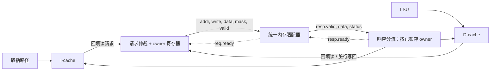

图按“内存返回读响应和写完成响应”的教学协议说明。若课程写接口没有响应，需要按正式约定定义写完成事件，不能虚构一个 ack 或把 req.fire 无条件等价为数据已经落入内存。

```scala
class MemoryRequest extends Bundle {
  val address = UInt(32.W)
  val write = Bool()
  val data = UInt(32.W)
  val mask = UInt(4.W)
}

class MemoryResponse extends Bundle {
  val data = UInt(32.W)
  val error = Bool()
}
```

`Decoupled` 只给传输握手。一次只有一个在途请求时，可在仲裁器保存 owner，不必让下级携带 ID；若允许多个在途、返回可能乱序，就需要 ID 和映射表，而不是靠“最近一次选了谁”。

### 8.2 单在途仲裁器的三个阶段

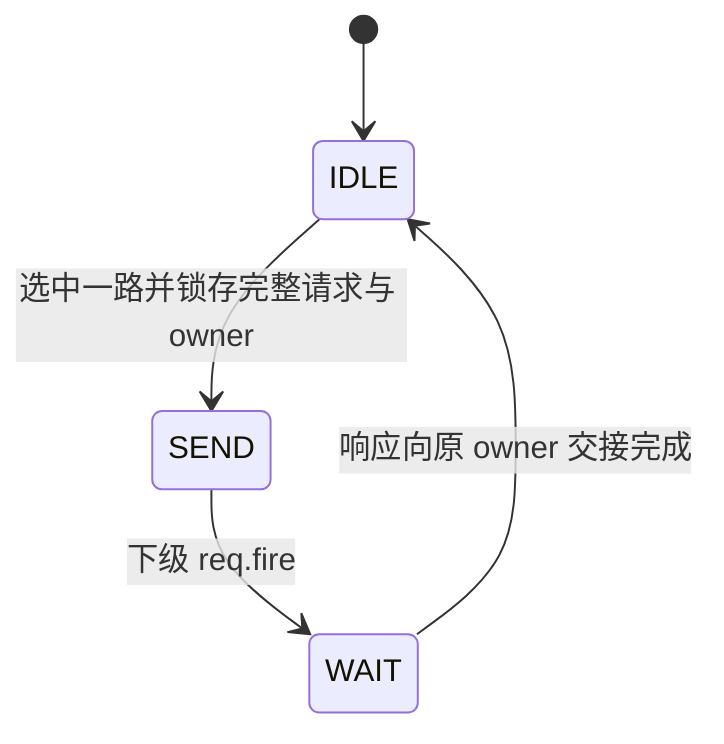

该结构在 IDLE 接收一个上游请求，保存进请求寄存器；SEND 中即使另一侧来了新请求，也不改变当前 owner 和 payload。只有原请求完成后才重新仲裁。

响应分流依据事务接收时保存的 owner：

```text
owner=I → 只给 I-cache resp.valid，resp.ready 取 I-cache 的 ready
owner=D → 只给 D-cache resp.valid，resp.ready 取 D-cache 的 ready
```

轮询仲裁可以防止一侧持续有请求时另一侧饥饿；固定 D 优先虽简单，但要检查密集访存是否让 I-cache 永远得不到服务。响应背压未解除前不能清 busy，否则会覆盖尚未交付的事务身份。

### 8.3 “20 周期内存”不等于“20 周期回填一整行”

以 32 B 行、32 位下级端口为例，一行要 8 次字传输。

| 下级能力假设 | 8 字回填的理想时间量级，不含额外控制拍 |
| --- | --- |
| 单在途，每字响应延迟 20 周期 | 约 `8×20=160` 周期 |
| 每拍接一字、可有至少 8 个在途、各字延迟 20 周期 | 首字约 20，末字约 27 周期 |
| 支持整行 burst | 由 burst 首字延迟和拍间隔决定 |

第二、第三行只有在正式内存协议允许时才可采用。若 D-cache miss 还要先写回 8 个脏字，再读入 8 个新字，单在途逐字模型可能接近 320 周期，加上仲裁和状态切换还会更长。

Cache 行大小是局部性收益、回填带宽与 miss 代价之间的取舍。把软件数组瞬间装入 32 字节再只等待 20 周期，会掩盖真实接口成本。

### 8.4 Store 的执行、提交和排空是三个时点

对于乱序核：

```text
执行：计算 store 地址和数据，保存在推测 Store Queue
提交：到 ROB 队首，确认不会再被更老的错误路径取消
排空：已提交 store 真正写入 D-cache/统一内存，之后释放缓冲
```

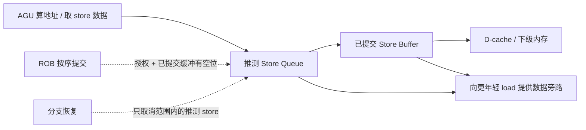

一条错误路径 store 不能在提交前修改正式 D-cache 数据/dirty 状态或外部内存，除非实现了可靠的版本化回滚机制。首版把这类副作用延后到提交授权之后最容易推理。

已提交但未排空的 store 不能被年轻分支的 flush 删除。程序结束时，若测试平台直接检查下级内存，还要按交付协议排空写缓冲及脏行，或让检查器读取一致的最终状态，不能因数据还在 Cache 里就报告“内存写丢了”。

### 8.5 Store-to-load forwarding：逐字节找最近的老 store

```asm
sw x5, 0(x1)
lw x6, 0(x1)
```

如果 store 已有地址和数据，但尚未写下级，load 直接从旧内存读会得到错误结果。可以从更老的 store 中转发数据。

基本规则：

1. 只看比当前 load 更老的 store。
2. 地址有重叠时，对每个字节选择最近的老 store。
3. 地址或数据未准备好时，保守等待；不能直接宣称不相关。
4. 若只覆盖 load 的部分字节，首版可以等待排空后再读；高级实现才合并多笔 store 和 Cache 字节。

同周期的多路 store 匹配需要年龄优先级与字节 MUX，不是一个简单 `addr == addr`。内存相关性和转发可参考 [BOOM LSU](https://docs.boom-core.org/en/latest/sections/load-store-unit.html)。

### 8.6 分支恢复、Cache 回填与 I/D 一致性

普通缓存内存的错误路径 load 被取消后，可以继续完成已发出的读并把行放入 Cache，但不能把结果写给已失效的 CPU 指令。**填 Cache 与完成某条 load 是两个不同的有效性判断。** 设备/MMIO 等有读副作用的区域不能沿用这个推测规则。

I/D 分离还带来另一件事：D-cache 修改某地址后，I-cache 可能仍持有该地址的旧指令。课程豁免 `FENCE.I` 不能自动推出程序允许任意自修改代码；应明确测试环境是否会运行中修改代码、何时装载程序，以及需要怎样的复位/失效化约定。

<a id="s9"></a>
## 9. 把结构接成整机：数据、完成和恢复三套通路

### 9.1 画顶层之前，先写端口预算

下面是一份双发射候选配置的预算表，数值用于讨论，不承诺达到评分指标：

| 资源 | 示例预算 | 调度器必须遵守的限制 |
| --- | --- | --- |
| 分派 | 最多 2 条/拍 | 所有目标队列一起接收同一前缀 |
| 发射 | 总共最多 2 条/拍 | 总宽度限制不能被各队列单独绕过 |
| 整数 ALU | 2 路，其中一路支持 Branch | 同类请求不超能力 |
| LSU/AGU | 1 路 | 每拍至多一个新地址计算/请求，另看接口 ready |
| 乘法器 | 1 路 | 按实际 II 判断是否 ready |
| 除法器 | 1 路迭代 | busy 时不发第二条 |
| PRF | 最多 4 读、2 写 | 发射需要的源读总数不能超额 |
| 完成接收 | 2 路/拍 | 同拍更多完成项要缓存/仲裁 |
| 提交 | 最多 2 条/拍 | 必须是 ROB 队首连续前缀 |
| 下级内存 | 初版单在途 | I/D 共享同一个事务资源 |

两条发射指令可能来自整数、访存、MDU 不同队列，因此需要协调总发射预算；分别让每个队列“最多发两条”会使整个核越过既定读端口能力。

### 9.2 写回仲裁：每拍发两条，也可能同时完成四条

不同执行延迟会让先前发出的请求集中到同一拍完成：

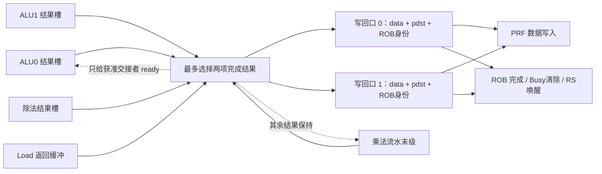

每个完成源都必须能保存结果，或在更早时预留保证不会冲突的写回时隙。仅靠一个单拍 done 脉冲，会在写回冲突时丢结果。

一次被接受的完成事件，应协调 PRF 写入、Busy 清除和 ROB done 更新。若拆到不同周期，要显式寄存事件并约定何时允许消费者读取；不能先把源标成 ready，却还没保证数据可从 PRF 或旁路获得。

固定优先级可能让慢单元完成结果长期等不到端口。轮询、年龄优先或为某些通道预留能力，都是需要通过饥饿测试的策略。

### 9.3 一个 mixed workload 的执行思路

```asm
mul x5, x1, x2      # 慢，但不一定阻塞其他独立指令
add x6, x3, x4      # 独立
add x7, x5, x6      # 同时等待前两条
lw  x8, 0(x9)      # 地址若就绪，可在资源允许时先发请求
```

乱序核可以让第二条先完成，让第四条先启动内存等待；第三条在 x5 和 x6 都就绪后发射。ROB 仍然先等第一条完成，不能因为第二条先结束就任意越过队首提交。

这里的收益来自**重叠等待与独立工作**。如果所有指令都串行依赖同一条乘法链，扩大 ROB 或再加 ALU 不会缩短那条乘法链本身。

### 9.4 分支恢复必须同时处理四本账

```text
1. 控制流：正确 PC，取指/译码缓冲中的路径有效性
2. 指令流：ROB、RS、LSQ 中哪些动态指令被取消
3. 寄存器版本：RMT、Free List、Busy 与新旧物理目的
4. 外部事务：已经发出的内存/MDU 请求如何完成或丢弃
```

两种较容易明确的恢复路线：

- **等错误分支到提交边界再恢复**：让所有更老指令先完成，取消年轻指令；按边界处的已提交映射重建推测状态。速度较慢，但恢复关系清楚。
- **在执行阶段提前恢复**：保留较老的未提交指令，通过分支检查点或精确回滚恢复到该分支边界。需要重命名映射与分配资源的配套恢复。

第二种不能简单 `RMT := AMT`，因为 AMT 中还不含那些必须保留的较老未提交指令。Free List 也不能随手恢复一张旧快照：期间可能发生老指令提交释放、寄存器重新分配，错误快照会造成泄漏或重复分配。

如果恢复采用多拍扫描，恢复期间应停止依赖这些中间状态的分派/分配，并让在途响应按明确规则被接收、保存或丢弃。不要让恢复一半的映射表被新指令读取。

### 9.5 长延迟旧结果：槽号相同，不一定是同一条指令

```text
时间 A：旧指令使用 ROB 槽 3、generation 7，发出 load
时间 B：旧指令被取消，槽 3 被释放
时间 C：新指令使用 ROB 槽 3、generation 8
时间 D：旧 load 返回
```

若只比较槽号 3，旧结果可能把新指令错误标为完成。响应要核对保存的身份与当前有效条目，失败就只完成外部握手，不更新 PRF/ROB。

不能只用“任意 flush 时把全局 epoch 加一，并丢弃所有旧 epoch”来处理保留老指令的恢复：较老的合法在途请求也可能携带旧 epoch。要么保留其有效身份，要么设计一种确实撤销全部相关在途指令的协议。

有限位宽 generation 也会回卷。需要证明旧响应最大寿命与槽位复用速度不会产生身份重复，或在可能回卷前排空相应事务。

### 9.6 ready 线也可能成为关键路径

```text
写回端口能接收
  → MDU 输出能前进
  → MDU 输入 ready
  → RS 能发射
  → RS 空位可供同拍分派
  → 分派 ready
  → 译码 / 取指 ready
```

数据寄存器很多，并不代表控制路径短。可以在关键边界加队列、限制同拍资源前递、拆开发射与寄存器读取，让组合依赖有明确边界。

同样需要避免组合环：例如 A.valid 依赖 B.ready，B.ready 又通过某条逻辑依赖 A.valid。先画 ready/valid 的依赖方向，再决定寄存器位置，比遇到工具报环后盲目插拍更可靠。

<a id="s10"></a>
## 10. 验证、测量与实施顺序

### 10.1 每个模块先交付四样东西

1. **接口表**：字段、方向、位宽、握手、复位和取消规则。
2. **状态表**：哪些是寄存器，哪些是存储器，何时变化。
3. **时序例子**：正常、停顿、边界、同时事件各一条。
4. **可检查的性质**：不丢、不重、不越界、结果正确、身份正确。

代码长度不是完成度。一段十行的握手错误，可能破坏一整个 CPU；一张精确的边沿表常常能提前发现问题。

### 10.2 建议的模块测试矩阵

| 结构 | 最少覆盖哪些情况 | 检查什么 |
| --- | --- | --- |
| 五级流水 | RAW、连续写同一 rd、load-use、store 数据依赖 | 最新生产者优先，停顿与气泡范围正确 |
| 双重命名 | 同组 RAW/WAW、写 x0、只接收一条 | 映射、oldPdst 与资源扣减一致 |
| 发射选择 | 两路竞争同项、类型受限、执行器 busy | 不重复发射，实际 fire 才删除 |
| 双提交 | 队首未完成、第二项未完成、同 rd、store 缓冲满 | 只提交合法前缀 |
| 乘法 | 0、1、全 1、最小负数、各符号组合、高半结果 | 完整 64 位结果和输出选择 |
| 除法 | 除零、N<D、N=D、溢出、所有正负组合 | 向零截断、余数符号与算术恒等式 |
| MDU 接口 | 连续请求、长期响应背压、复位/取消 | 不覆盖结果，ID 与数据一致 |
| I-cache | 冷 miss、重复 hit、冲突、跨行取双指令 | 行匹配、槽有效性、PC 推进 |
| D-cache | SB/SH/SW、读后写/写后读、脏替换 | 每字节结果、victim 写回地址 |
| 仲裁器 | I/D 同时请求、请求/响应背压 | owner 稳定、公平、无重复事务 |
| 恢复 | Load/MDU 在途时误预测、槽位复用 | 旧结果不污染新状态，老指令保留 |
| 参数 | 最小容量、宽度 1/2、ROB=24/32、PRF=48/64 | 非 2 的幂回卷、索引与计数正确 |

### 10.3 算术核心的参考模型不要照抄硬件算法

验证迭代乘法时，参考模型直接用大整数乘法；验证逐位除法时，参考模型先处理 ISA 特例，再用大整数除法。这样才能发现迭代算法本身的错误。

```cpp
// 参考模型片段：uint32_t 输入解释为有符号数学值，使用 int64_t 安全计算。
int64_t signed_value(uint32_t bits) {
    return bits < 0x80000000u ? int64_t(bits)
                             : int64_t(bits) - (int64_t(1) << 32);
}

uint32_t ref_div(uint32_t a_bits, uint32_t b_bits) {
    if (b_bits == 0) return 0xffffffffu;
    if (a_bits == 0x80000000u && b_bits == 0xffffffffu)
        return 0x80000000u;
    return uint32_t(signed_value(a_bits) / signed_value(b_bits));
}
```

这个例子避免把无符号位模式直接依赖宿主的越界有符号转换，也不在 32 位有符号范围里执行溢出除法。随机测试时还应检查 `N=Q*D+R` 和余数范围，但这些性质只适用于各自的非零/非溢出数学条件。

对于握手模块，用软件队列保存每次输入 `fire` 的期望结果，只在输出 `fire` 时弹出比较；背压期间反复看到 `valid=1`，不能当成多个完成事件。

### 10.4 Cache 用什么当参考模型

用一个按字节寻址的软件内存作为顺序参考；CPU load/store 的架构结果与它比较。另建下级事务记录，检查回填地址、写回地址和掩码。

写回 Cache 内部允许下级内存暂时落后于逻辑内存，不能每次 store 后立刻要求下级数组已经改变。需要把“CPU 可见的正确结果”和“排空之后下级内容一致”分别检查。

随机化 req.ready、resp.valid 延迟、resp.ready，再覆盖两个 Cache 同时缺失，能发现只在无背压环境中看不出的重发、错路由和覆盖响应问题。

### 10.5 整机按提交轨迹对拍

乱序执行会改变执行和完成时间，但不应改变按序提交的架构效果。输出：

```text
commit lane：valid、PC、instruction、rd、写回值、store 地址/数据/mask
```

同拍两条按程序顺序送给参考解释器，比较寄存器和内存效果。对于写缓冲，应区分 store 的逻辑提交记录与实际下级写事务；一个 store 不应因延后排空被重复记为两次架构提交。

### 10.6 性能计数器应该揭示瓶颈

| 计数器 | 解释 |
| --- | --- |
| committed / cycles | 按正式区间和口径计算 IPC |
| 每拍提交 0/1/2 条的分布 | 看双宽能力是否实际利用 |
| ROB/RS/PRF 资源不足 | 窗口或寄存器是否限制并行 |
| 就绪但执行单元不 ready | MDU/LSU 是否成为吞吐瓶颈 |
| 写回仲裁等待 | 完成带宽是否不足 |
| I/D miss 数与等待周期 | 分清 miss 频率和单次 miss 代价 |
| 下级仲裁等待 | I/D 竞争是否严重 |
| 分支错误与恢复周期 | 控制流损失有多大 |

各种 stall 原因可能重叠，不能把它们直接相加当作总停顿。可以同时记录独立事件，以及按确定优先级归类的“本拍主要阻塞原因”。

频率必须看实际关键路径。300 MHz 约为 3.33 ns 周期预算，但还要为时钟、建立时间和具体流程约束留出空间。增加流水级可能提升频率，也可能增加 load-use/分支代价；用同一 Benchmark 同时比较 IPC、面积和频率。

### 10.7 按依赖顺序实施，不一次堆上所有复杂性

| 阶段 | 交付物 | 进入下一阶段的条件 |
| --- | --- | --- |
| A：模块与接口 | ALU、寄存器/队列、MDU、内存适配器 | 独立测试与背压测试通过 |
| B：单通道基线 | 五级教学核，或选定乱序架构的宽度 1 配置 | 提交对拍稳定，工具链可综合 |
| C：真实内存路径 | blocking I/D-cache + 统一仲裁 | miss、脏写回、子字 store、最终排空正确 |
| D：双宽主线 | 双分派、资源受限双发射、多路完成、双提交 | 独立指令可双处理，依赖与恢复正确 |
| E：针对瓶颈优化 | 流水乘法、写缓冲、Cache/窗口调整等 | 同条件实验说明收益与成本 |
| F：参数扫描 | 合法配置的正确性、IPC、面积、频率表 | 得到可复现的最终配置与报告 |

阶段 B 的两种路线是选择关系：**五级核用于建立硬件直觉与基线；若团队决定做 PRF/ROB 乱序主线，不必先完整实现双发射五级核再推倒重写。** Cache 和 MDU 可以先用稳定协议独立开发，再接入选定主线。

### 10.8 图纸到代码的最后核对

写每个模块时，把图里的框与代码对齐：

- 一个状态框，对应 `Reg`、`RegInit` 或明确的存储阵列。
- 一个数据选择点，对应 `Mux`/条件连接，并写清优先级。
- 一条数据总线，对应固定的类型、位宽和有效性条件。
- 一条跨周期事务，对应保存的请求身份、接受事件和完成事件。
- 一条等待反馈线，对应可以解释的 ready/stall 路径，不能形成组合环。
- 一个恢复事件，对应明确的取消集合，不能误删已提交或仍需保留的状态。

本文提供的是结构设计与教学 RTL。编写时已用 Python 按文中迭代方程建模，对 2～8 位的 87,376 组输入穷举，并对 20,064 组 32 位边界/随机输入检查无符号乘除、乘法符号修正、有符号除法包装及分块乘法恒等式；结果与独立的大整数运算一致。文中的 C++ 除法参考片段也通过了编译和负数、除零、溢出用例检查。

这些是数值算法检查，**不是 Chisel RTL 仿真结果**。当前尚未编译仿真本文的 Chisel 核心，时钟、复位、握手、取消及综合结果仍需在实际工程中验证。Markdown 的本地链接、锚点、代码围栏已检查；Mermaid 图尚未在本地渲染核验。任何结构是否满足项目面积与频率目标，都要由正式工具流程验证。
