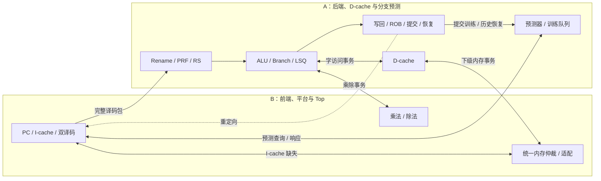

# ParaRisc 双人均衡分工：A 后端、D-cache 与分支预测，B 取指译码与平台

> 用户承担 A 角色，B 暂不在文档中绑定具体人员。本方案以 [项目目标](../project-requirements.md) 和 [硬件设计指南](../guides/cpu-hardware-design-guide.md) 为依据。执行状态见 [清单](todo.md)。

> 宽度 2 的具体资源端口和冲突规则统一见 [端口预算](port-budget-and-ipc.md)；端口预算变化需双方同步调整接口与测试。

## 1. 新边界：两人各自拥有完整的模块闭环

| 角色 | 实现范围 | 验证和交付 | 独立开发时使用 |
| --- | --- | --- | --- |
| **A：后端、D-cache 与分支预测** | 重命名、PRF/Busy、RS/发射、ALU/分支判定、AGU/LSQ、ROB/提交/恢复、D-cache、预测器及训练队列 | 后端与 D-cache 单测、核心参数实验、架构探索报告 | 译码包发生器、统一内存/MDU 替身 |
| **B：前端与平台** | PC、取指缓冲、双译码、I-cache、统一内存仲裁/适配、乘除法、Top、公共类型代码 | 独立 RV32IM 参考模型、提交对拍工具、前端/平台测试、构建评测脚本、参数报告 | 后端接收器、D-cache 替身、事务发生器 |

取指、I-cache 和译码由 B 负责；预测器独立交给 A，包含方向/目标预测、预测表、训练队列，以及实际采用的历史/RAS 状态和恢复。B 通过查询/响应接口使用预测，不直接访问预测器内部状态。A 保有紧密耦合的 RMT/ROB/PRF/RS/LSQ 状态，并负责与 LSU 紧邻的 D-cache。B 维护独立参考模型、提交对拍工具、Top 和评测入口；A 提供提交轨迹及后端定向测试。D-cache 与 B 的统一内存仲裁只通过冻结的下级请求/响应接口连接，双方可各用替身独立开发。功能错误由对应模块负责人修复。

两人都要实现 RTL、编写本域测试、处理本域集成问题、运行自己的参数实验，并各主笔一份报告。五级流水线仍用于学习或对照，不额外要求完成第二颗 CPU。主线从宽度 1 的 PRF/ROB 结构扩展到宽度 2。



## 2. 工作量预算：各八个任务包，A 108 / B 92 相对点

点数同时估计实现、模块测试、调试和接入工作，**不是已经测得的工时**。每个包的单测和常规返工都算在本包内，不能把测试工作全部留到集成阶段。左右同行无需同步完成。

| A 的任务包 | 点 | B 的任务包 | 点 |
| --- | ---: | --- | ---: |
| A1 Backend 骨架及前端/服务替身 | 4 | B1 公共类型代码、工具链、Top 骨架、替身 | 14 |
| A2 RMT/AMT、Free List、PRF/Busy、双重命名 | 16 | B2 PC、取指队列、预测查询接入、重定向和旧请求隔离 | 8 |
| A3 ROB、双提交、回收和分支恢复 | 16 | B3 RV32IM 双译码、立即数和完整译码包 | 8 |
| A4 RS、唤醒、双发射、旁路和写回仲裁 | 16 | B4 I-cache、跨行取指、回填与独立测试 | 12 |
| A5 ALU、Branch/JAL/JALR、预测器、训练队列与恢复 | 16 | B5 独立 ISA 模型、提交对拍工具和功能验收 | 10 |
| A6 AGU、LSQ、Store Buffer、访存顺序和事务 ID | 16 | B6 I/D 仲裁、统一内存适配、延迟模型 | 12 |
| A7 D-cache、掩码写、脏替换、写回和排空 | 18 | B7 乘除法器、MDU 背压和数值验证 | 16 |
| A8 核心、D-cache 与预测器参数实验、优化和架构报告 | 6 | B8 自动评测、综合/时序、平台优化、数据汇总和参数报告 | 12 |
| **合计** | **108** | **合计** | **92** |

相对原分工，B 的完整 D-cache 包（18 点）转给 A；A 的独立 ISA 模型与对拍包（10 点）转给 B；共享类型代码维护和工程接口整理（原 A1 中 6 点）转入 B1；跨域实验数据汇总（原 A8 中 2 点）转入 B8。A 仍主笔架构报告并产出自己的原始实验数据。这样调剂的是完整模块或明确的工具责任，不拆分 ROB/LSQ 状态；上述调整后原为各 100 点；本次再将 B2 的预测器、训练队列及其测试（估计 8 点）转入 A5，形成 A 108 / B 92，约 54% / 46%，仍在 45%～55% 目标内。实际工时需按里程碑复估；复杂预测方案另行估点，不能无限追加到 A。

这是初始估算，不能只凭条目或点数断言实际工作严格对半。A3/A6/A7、B2/B7 等复杂包完成首个可运行版本后要重新估计。G1、G2、G4 检查剩余工作量，目标让任一方的预计总投入尽量处于 **45%～55%**。偏差较大时优先转交完整的实验批次、测试集或有稳定接口的叶模块及其测试；不把 ROB、PRF、RS 或 LSQ 的共享状态拆开凑数。超出预算的可选优化重新估点并决定负责人。

首版功能贯通范围为：可验证的恢复策略、保守访存顺序、简单分支预测、blocking Cache、完整 M 扩展的迭代运算基线。宽度 2 性能配置按[端口预算](port-budget-and-ipc.md)将乘法升级为每拍可启动一笔的流水实现；迭代除法继续独立运行。提前恢复、非阻塞 Cache、高级 store forwarding 和复杂预测器按性能瓶颈及剩余预算选择。这控制开发顺序，不删减课程必需功能，也不把功能基线当作已达成 IPC 目标。

## 3. 模块所有权和交付责任

| 模块/事项 | 主责 | 与另一方的约定 |
| --- | --- | --- |
| PC、取指事务、指令缓冲 | B | 收 A 的重定向和预测响应；不读 ROB 或预测表 |
| 预测器、预测表、训练队列、历史/RAS 恢复 | A | 接 B 的查询；提交训练与后端恢复在 A 域内连接 |
| RV32IM 硬件译码、立即数、指令类型 | B | 输出架构寄存器名和控制字段，不分配物理寄存器 |
| RMT/AMT、Free List、PRF/Busy、RS | A | 组内前递、唤醒和分配保持本域闭环 |
| ROB、提交、恢复、结果仲裁 | A | 输出 redirect/train 和提交轨迹 |
| 普通 ALU、实际分支判定、AGU/LSQ | A | 根据预测信息计算恢复，向本域 D-cache 和 B 的 MDU 发事务 |
| 推测 Store Queue、已提交 Store Buffer | A | 只把提交授权后的 store 送往本域 D-cache |
| D-cache、脏行写回与排空 | A | CPU 口接 A 的 LSU；下级口接 B 的仲裁器，独立事务测试不依赖真实 Top |
| I-cache、统一内存仲裁、课程适配 | B | I-cache 与 D-cache 最终共享一个下级内存；用 D-cache 替身验证仲裁 |
| MDU 的八种 M 指令、结果缓冲 | B | 收两操作数及 op，不读取 PRF/ROB |
| D/MDU 事务 ID 和迟到结果筛选 | A | D-cache 与 B 的 MDU 原样返回不透明 ID |
| IF 事务 ID、错误路径取指返回筛选 | B | 旧请求排空，但不交给新路径 |
| 参考模型、提交对拍工具与整机功能验收 | B | 与 B 的硬件译码分开实现，不复用译码结果；A 提供后端定向场景和提交轨迹 |
| Top、构建、仿真、综合/时序脚本 | B | A 提供 Backend 入口和结果轨迹 |
| 架构探索报告 | A 主笔 | B 提供前端/I-cache/MDU 数据与对拍结果 |
| 参数敏感度报告和复现说明 | B 主笔 | A 提供核心、D-cache 与预测器参数实验及解释 |

模块所有者负责单测、参数合法范围、可综合性和本域缺陷。B 维护 `common/` 中的类型定义代码，接口字段和语义由双方在 G0 共同冻结；目录归属不允许一方单独改变另一方依赖的协议。

## 4. 共同冻结的接口：前端包、恢复、数据和乘除

G0 先产出可编译的 `Bundle`、参数和空壳，同时确认 [端口预算](port-budget-and-ipc.md) 的宽度 2 配置。接口固定以后，两人可分别开发实现。以下是建议的 v1 契约，另须冻结 D-cache 的下级内存请求/响应、写回与排空接口。

### 4.1 B → A：完整译码包

`Decoupled[DecodedPacket]` 的 `count` 为 1 或 2，槽按程序顺序排列，逐槽带：`pc、rawInst、op/fuClass、rs1/rs2/rd、usesRs1/usesRs2/writesRd、immediate、访存大小、分支类型、predictedTaken/Target、predictionMeta、decodeError`。包另带 `pathId`。字段宽度和编码只在 `common/` 定义一次。

**交界处整包交接：** B 在 ready 为 0 时保持整个包；A 在 fire 后把整个包存入自己的输入缓冲，再按内部资源情况逐条或按连续前缀重命名。A 的内部输入缓冲满时反压 B。这样即使同包两条都访问单端口 LSQ，A 也能先处理第一条、稍后处理第二条；不必让 B 预判 A 的资源组合，更不会因一个永远无法整包分派的组合而死锁。

同一周期前端输出包和重定向同时有效时，按下节定义的取消优先级处理；其他时候遵守普通 `valid/ready` 稳定规则。首版可让 A 的输入缓冲只接一包，性能优化后再加深。不得在 `ready=1` 时暗中只消费一个槽。

### 4.2 A → B：重定向；B ↔ A：预测查询

重定向至少携带目标 PC、恢复原因和新路径身份，走独立控制通道；译码包遭背压时仍要能接收重定向。约定：重定向 fire 的边沿优先于同拍旧路径译码包的交接，A 在该边沿压低旧包 ready，双方不计入旧包 fire；B 清空其旧路径缓冲、切换 PC。A 同时按自身指令年龄规则清除已接收进输入缓冲、但属于错误路径的槽，保留合法老指令。旧取指请求若已经呈现，仍按协议交接和排空；B 依据请求保存的旧 pathId 丢弃迟到结果。

重定向是对普通“有效时保持包”的**明确取消例外**，双方要对同拍情况编写协议测试。A 内部较老的合法指令不会因前端 pathId 改变而全部失效。有限 pathId 和取指 ID 回卷前必须证明旧响应已经排空。

预测查询由 B 的取指端发给 A：请求携带 `queryId、pathId、候选 PC[2]、slotValid`，响应原样返回身份，并逐槽携带方向、目标、有效性与 `predictionMeta`。双方在 G0 固定查询延迟、吞吐和最大在途数；宽度 2 目标为每拍接受一组最多两个 PC。请求/响应采用 valid/ready，背压时保持；重定向后 B 消费并丢弃旧路径响应，ID 在旧事务排空前不复用。B 负责按最早预测跳转截断取指包，并将元数据原样带到译码包。若采用投机历史/RAS，B 另发送实际采用预测的有效槽掩码和身份，A 仅按已接受的有效前缀更新状态；取消与恢复优先级须在 G0 固定，禁止因重复查询而重复更新历史。

预测训练在提交时由 A 的后端直接送往 A 的预测器，携带分支 PC、实际方向/目标和随指令保存的 predictionMeta。A 保存/更新预测表。宽度 2 配置中，A 的训练队列每拍可接两项、预测表每拍更新一项；队列余量不足时，A 限制本拍可提交的控制流指令，不能丢第二项训练。预测历史恢复由 A 与后端恢复协调，训练背压不能堵住发给 B 的紧急重定向。

### 4.3 LSU ↔ D-cache、后端 ↔ MDU：事务

| 通道 | 请求字段 | 响应字段 |
| --- | --- | --- |
| D 端口（A 域内） | `txnId, wordAddr[31:0], isWrite, data[31:0], mask[3:0]` | `txnId, data[31:0], error`；写为确认 |
| MDU 端口 | `txnId, op, lhs[31:0], rhs[31:0]` | `txnId, result[31:0], error` |

请求/响应都使用 `valid/ready`，交接只看 `fire`；生产者在背压期间保持 valid 和全部字段。A 的 LSU 把 store 源数据按小端字节位置移位、生成 mask；A 的 D-cache 按 mask 更新已对齐的 wordAddr。初版 D 口单在途并保持请求顺序；MDU 初版单在途，可在不变更外部格式的前提下扩容。响应可变延迟，且必须保持到消费者接受。

A 的后端维护 `(channel, txnId) → {动态指令身份、目的、是否取消}`；ID 在终结响应 fire 前不复用。已呈现但尚未 fire 的请求遇到恢复时，仍保持至 fire，之后等响应并丢弃；已接收的普通读/MDU 请求同理。D-cache 和 B 的 MDU 不需要知道 ROB 年龄。后端必须消费迟到响应，不能永久堵住结果槽。

后端只向 D-cache 发送已提交 store。D-cache 的写确认代表数据已在缓存内生效、对随后经 D 口的访问可见；写回 Cache 不要求此时主存已更新。后端保留尚未确认的 store 数据，首版可等待较老 store 排空再发相关 load。若正式环境要求精确写错误，需重新定义提交与错误确认时点。

### 4.4 D-cache（A）↔ 统一内存仲裁（B）

I-cache、D-cache 共用一套下级内存请求/响应类型：`requestId、wordAddr、isWrite、data、mask` 与对应 `requestId、data、error`；缓存行由多个字事务组成，不能假定一次 20 周期请求返回整行。A 的 D-cache 发出缺失回填和脏行写回，B 的仲裁器只按事务与仲裁规则处理，不读取 LSQ/ROB 状态。两方共同冻结最大在途数、响应顺序、背压、复位和错误语义；在正式协议未确认前按单在途保守实现。A 用 MockMemory 验证 D-cache，B 用 MockDCache 验证仲裁器，接合时再检查 I/D 同时 miss 与脏写回竞争。

### 4.5 启动、停止和最终内存检查

复位、启动地址、程序结束、下级内存 3/20 周期定义和报错处理在 G0 核对；课程细节未确定前保持可配置，不把教学存储器假设当作正式协议。

结束时 A 停止新指令工作，但继续交接已呈现请求、发送此前已提交而未发出的 store，接收全部 D/MDU 响应。B 停止新路径取指并排空旧 IF 请求。A 的事务表和 Store Buffer 为空后，A 排空 D-cache 脏行；B 排空 I-cache 请求、仲裁器和下级待写事务。A 报告后端及 D-cache drain 状态，B 汇合两方状态后由 Top 报告 drainDone，随后才以最终主存内容验收。

## 5. 双方各自能够运行的测试环境

**A：** 用 PC 查询发生器和脚本化训练/恢复事件独立测试预测器；用译码包发生器直接驱动 Backend；用事务发生器驱动真实 D-cache，以 MockMemory 检查掩码写、替换、回填和排空。简化行为前端、MockMDU 与 MockMemory 支持可变延迟、背压与迟到结果。A 输出稳定提交轨迹，编写后端/访存定向场景，交由 B 的独立模型检查架构效果。

**B：** 用 `BackendSink` 对真实 Frontend 提供 ready、脚本化重定向；用 MockPredictor 提供预测响应、背压和迟到结果；用事务发生器驱动真实 MDU/统一内存仲裁，以 MockDCache 和软件字节内存作裁判。B 的独立 ISA 模型直接解释原始指令与架构状态，不复用自己的硬件译码；提交对拍比较 PC、指令、寄存器和 store 效果。I/D 最终访问同一个下级镜像。B 不必为测试而实现 ROB 或 PRF。

两边共同跑的协议场景：双槽包背压和整包交接；重定向与旧包同拍；旧 IF 响应迟到；D/MDU 响应长期背压；分支恢复时老指令保留、年轻结果丢弃；已提交 store 不因恢复消失；I/D 同时 miss；结束时 Store Buffer/脏行排空。这些场景先在替身中通过，再用真实模块重复。

## 6. 并行里程碑与均衡复核

| 检查点 | A 独立工作 | B 独立工作 | 接合与复核 |
| --- | --- | --- | --- |
| G0 接口 | Backend/D-cache/预测器空壳及替身 | 公共类型、Frontend/平台/Top 空壳、MockPredictor、模型与工具入口 | 冻结译码包、redirect、预测查询/采用通知、MDU、D-cache 下级口、排空 |
| G1 最小连线 | 译码包发生器、后端资源账本、D-cache 替身 | BackendSink、前端/MDU/统一内存协议测试 | 真实空壳连线，不等完整核心 |
| G2 宽度 1 | Rename/PRF/RS/ROB/提交闭环、D 直通替身 | 真实译码、MDU 全语义、独立 ISA 模型 | 前后端+MDU 功能对拍；复估工量 |
| G3 真实访存 | LSQ、store 提交、D-cache、ID 过滤 | I-cache、统一内存与仲裁 | I/D 同一内存，恢复和排空联测 |
| G4 双宽/Cache | 双分派/发射/提交、后端、D-cache 及预测器参数 | 双取指/译码、I-cache/平台参数 | 完整 RV32IM、Cache、MDU 回归；复估工量 |
| G5 指标/交付 | 后端/D-cache 正确性、参数实验和报告 | 正式指标脚本、前端/平台实验和报告 | 3 个基础程序、Simulator 程序、20 周期 Benchmark、面积/时序 |

G2 的 D 直通替身仍经 B 的统一仲裁器和同一块下级内存；G3 将其替换为 A 的 D-cache。每次只替换少量真实模块，保留上一份通过回归的配置；真实仲裁器没准备好时 A 继续 MockMemory 回归，后端/D-cache 没准备好时 B 继续 MockDCache 测试。

## 7. 建议目录与修改规则

以下目录只是将来工程布局，目前并未创建 Scala 源码。

```text
src/main/scala/pararisc/
├── common/          B 维护共享类型代码，接口语义由双方共同冻结
├── backend/         A：rename / regfile / scheduler / execute / lsu / commit
├── frontend/        B：pc / fetch / decode
├── predictor/       A：方向/目标预测、训练队列、历史恢复
├── cache/dcache/    A：D-cache 与下级事务状态
├── cache/icache/    B：I-cache 与回填状态
├── platform/        B：统一内存仲裁 / 课程适配 / mdu
└── Top.scala        B

src/test/scala/pararisc/
├── backend/         A：单测、行为前端、服务替身
├── frontend/        B：单测、BackendSink 和 MockPredictor
├── predictor/       A：查询发生器、训练/恢复与双槽测试
├── cache/dcache/    A：D-cache 单测与 MockMemory
├── cache/icache/    B：I-cache 单测与 MockDCache
├── platform/        B：统一内存/MDU 事务测试
└── integration/     A：后端定向场景；B：对拍工具、Top 与运行配置

tools/reference/      B：独立 ISA 模型与提交检查
tools/simulation/     B：装载、驱动、日志
tools/evaluation/     B：综合、时序、扫描脚本
experiments/backend/ A：核心、D-cache 与预测器配置测量
experiments/platform/ B：前端、I-cache、MDU 配置测量
```

每人维护自己的实现与测试；共享接口改动先给出兼容影响和双方需要修改的协议用例。Top 出现功能错误时，B 的对拍工具定位首个错误提交，A 检查后端/D-cache 状态，B 检查前端/平台响应和连线，最终由出错模块所有者修复。构建与评测脚本由 B 提供，A 负责本域无法综合或时序不达标的 RTL 改进。任务转交时一起转移代码、测试、验收责任和工作量点数。

## 8. 交付与首次领取任务

A 提交 Backend、D-cache、预测器、对应单测、核心、D-cache 与预测器参数实验及架构报告；B 提交 Frontend/I-cache、统一内存/MDU、Top、独立 RV32IM 模型与提交对拍工具、评测脚本、平台参数实验及敏感度报告。两边共同验收课程要求的完整 RV32IM、统一内存和两份报告。当前性能冲刺目标沿用[项目需求](../project-requirements.md)，必须由真实集成后的 IPC、面积和频率证明。

第一轮：**A 领 A1/A2 并定义 D-cache 测试场景**，建立 Backend 空壳、译码包替身和物理寄存器版本账本；**B 领 B1/B2/B3 的最小切片**，建立公共类型、Top/工具入口、取指 PC 与译码包输出，并以 BackendSink 验证背压和重定向。G0 一起冻结契约，G1 做最小前后端连线，此后在 G2/G4 按剩余投入调整，维持实际工作量接近。
