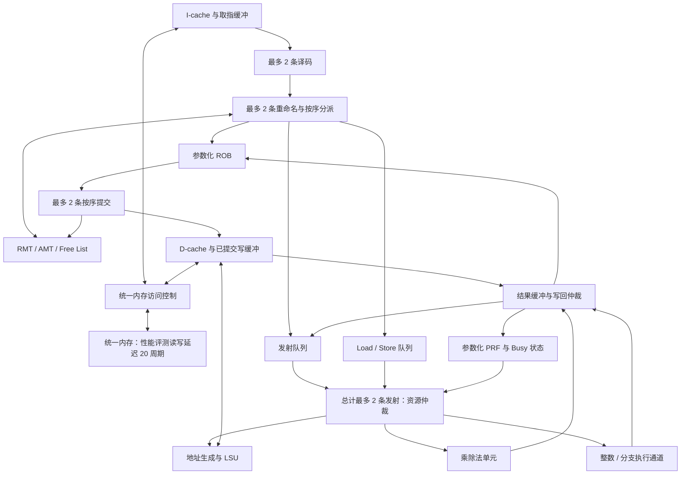

# 从两份 C++ Tomasulo 模拟器到 Chisel RV32IM CPU

> 用途：组会讨论旧项目经验如何迁移，以及本次多发射 CPU 的设计重点。
>
> 阅读日期：2026-09-20。本文检查了两份仓库的 CPU 调度、译码、RAT、ROB、RS、执行单元、LSQ、内存及预测相关代码。结论针对下表版本，不代表其他分支或尚未推送的实现。
>
> 配套材料：[项目目标](../project-requirements.md) · [面积、IPC、频率与 Benchmark](cpu-design-metrics.md)。

| 简称 | 仓库与核查版本 |
| --- | --- |
| Wilson／你的版本 | [WilsonWang621/RISC-V-CPU-Simulator，`c2ed311`](https://github.com/WilsonWang621/RISC-V-CPU-Simulator/tree/c2ed3118c5ef8b4baa663caeff36e970c2457200)，提交日期 2026-08-24 |
| Towns／队友版本 | [Towns30/RISC-V-Tomasulo-CPU-Simulator，`31e60fd`](https://github.com/Towns30/RISC-V-Tomasulo-CPU-Simulator/tree/31e60fda0420214db129b40e488e8b654cec6318)，提交日期 2026-08-06 |

## 1. 最重要的认识：已有乱序基础，新增的是可综合的资源与时序设计

两份旧实现都已经具备 **Tomasulo 调度、寄存器重命名、ROB 按序提交、结果广播和操作数旁路**。因此不能把本次任务描述成“第一次实现乱序”或“第一次加入 forward”。

本次需要把这些思想落实为 Chisel 生成的硬件，同时处理指定 RV32IM 子集、多发射、参数化、20 周期统一内存，以及面积和至少 300 MHz 的时序要求。原先的一次数组查询、遍历或函数调用，现在都需要对应到有限端口、比较器、加法器、选择器和寄存器。

**多发射与乱序是两个维度。** 旧设计能够让较年轻的就绪指令先执行，但前端每周期仍最多接收一条新指令，提交端也按一条推进。取得最高档的 IPC ≥ 1.0140，需要进一步提供长期平均每周期完成超过一条指令的能力。

建议本组重点评估“**双宽前端、双发射、双提交的精简乱序核心，配套 PRF、I/D-cache 和明确带宽的访存单元**”。这是结合已有经验提出的候选架构，是否达到 100 分要由 Benchmark、综合和时序结果验证；双发射顺序设计也可保留为对照方案。

## 2. 两份旧实现究竟有哪些差别

下表依据实际代码。代码中的 `Issue` 多数承担“按序分配 ROB、RS、LSQ 和重命名”的工作，更接近新文档中的 **Rename/Dispatch**；RS 挑选就绪指令送往执行单元，才对应后文所说的 **Issue/Select**。组内应先统一这两个词的用法。

| 维度 | Wilson 当前实现 | Towns 当前实现 | 对本次设计的影响 |
| --- | --- | --- | --- |
| 实现语言与周期状态 | C++17，`current → plan → apply → latch`，随机化模块调用顺序 | C++20，`UpdateCurrent → Execute → UpdateNext`，随机化 Execute 顺序 | 可沿用当前／下一状态思想；RTL 还需真实的组合路径与寄存器边界 |
| 指令语义 | RV32I 项目子集，含字节／半字 load，无 M 指令 | 同类 RV32I 指令，无 M 指令 | 新增 8 条 M 扩展指令；本次豁免四种小宽度 load，但仍需 SB／SH／SW |
| 分派／提交 | 每周期至多一条分派、一条提交 | 每周期至多一条分派；按单个 ROB 队首推进提交 | 改成多槽接口及连续前缀处理 |
| 重命名与结果存储 | RAT 指向 ROB tag；未提交结果保存在 ROB；提交写架构寄存器 | RAT 指向 ROB 下标；结果保存在 ROB；提交写架构寄存器 | 均没有独立、可调数量的 PRF，需要重新选择结果存储组织 |
| ROB 容量 | 32 项，显式计数，32 项均可使用 | 16 个数组槽，以空出一槽区分满／空，有效容量为 15 | 参数化需明确“数组槽数”与“可用条目数” |
| RS／LSQ | RS 16 项、LSQ 16 项 | RS 16 项；LSQ 16 槽、有效容量 15 | 支持多项分配、选择、完成，不能只替换数组大小 |
| 执行与广播 | 一个整数 FU 与 load 结果竞争一条 CDB，轮流仲裁，未获准结果保留 | 一个 ALU；ALU 与 LSQ 两组广播信号，消费者可同时吸收两路 | Towns 的两路结果信号不等于前端双发射；新设计需明确总写回带宽 |
| 已有寄存器旁路 | Issue 可取当前 CDB 或 ROB 已完成值；RS／LSQ 广播唤醒 | Issue 查询保存的广播快照及 ROB；RS 吸收 ALU／LSQ 广播，LSQ 吸收 ALU／内存返回 | 可以沿用匹配依赖的逻辑；实际旁路时点和通路需重画 |
| 分支预测 | Bimodal／GShare／Tournament；JAL 直接计算目标；JALR 默认顺序地址 | Fetch 输出的预测下一 PC 固定为 `PC+4` | 可参考 Wilson 的预测算法，新增或评估 BTB、RAS，核算表容量与访问时序 |
| 错误预测恢复 | 在分支／跳转到达 ROB 队首时恢复，清空年轻状态 | 同样在 ROB 队首判断并 flush | 执行阶段提前恢复有性能潜力，但需要部分回滚和映射恢复 |
| LSQ 实际访存 | 仅队首可发请求，后面的 load 不越过老 store | 可提前计算地址，但实际内存操作仍由队首推进 | 未看到 store-to-load 数据转发或乱序 load 访存机制，需要新增设计 |
| 地址计算资源 | 一次 `update_addresses()` 遍历计算所有满足条件的地址 | 每周期找到一个可计算地址的条目后停止 | Chisel 中必须显式限制 AGU 数量，避免无意复制多组加法器 |
| Store 完成方式 | ROB 队首授权，等实际内存写完后才完成提交 | 队首授权，等 Memory 的写完消息后出 ROB | 20 周期延迟下需重点评估提交与存储排空解耦 |
| 取指与数据访问 | 同一 MemoryImage；取指为直接读取，数据另有 3 周期事务 | 同一内存数组；取指独立处理，数据读写用 0／1／2 状态推进 | 不能直接继承旧取指成本；新设计须按统一内存协议建模 |
| tag 生命周期 | ROB tag 带槽号和 generation，防旧结果命中新槽 | 广播主要携带 ROB 下标，无 generation 字段 | 长延迟与取消请求下需明确旧响应隔离、槽位复用及回卷规则 |
| 资源背压 | 按指令类型检查 ROB 和相应 RS／LSQ | 全局 `RS ready && LSQ ready && ROB ready` 才推进前端 | 可减少与当前指令无关的结构造成的阻塞，但仍保持按序分派 |

源码定位：[W-CPU]、[W-Issue]、[W-ROB]、[W-RS]、[W-LSQ]、[W-Memory]、[W-CDB]、[W-Predictor]；[T-CPU]、[T-Issue]、[T-ROB]、[T-RS]、[T-LSQ]、[T-Memory]、[T-Fetch]。

**旧项目也使用了统一的字节存储镜像，不能简单概括为“以前哈佛、现在冯·诺依曼”。** 真正要重新核对的是：指令与数据的访问端口、仲裁、延迟和吞吐。一个软件数组可以被代码随时读取，但课程内存接口未必允许相同的并行度。

## 3. C++ 周期模拟如何变成 Chisel 电路

### 3.1 可以迁移的原则

旧代码的“所有模块读取当前状态，再生成下一状态”，对应同步硬件的基本工作方式。Chisel 的 `Reg` 保存跨周期状态，`Wire` 与组合表达式描述本周期逻辑，时钟边沿更新寄存器。

原来的 `plan()` 可帮助我们提取组合输出；`apply()` 中的更新规则可帮助定义寄存器下一状态；`latch()` 的概念对应时钟边沿。无需在 Chisel 中复制随机模块调用过程，应通过信号连接和明确的状态优先级表达相同语义。

| 旧 C++ 操作 | 在硬件中需要明确什么 |
| --- | --- |
| `rob.lookup(tag)`／`registers.Read()` | 多少个读端口、组合读还是同步读、读写同址行为 |
| 循环检查所有 RS 条目 | 标签比较器规模、就绪向量、选择器深度和公平性 |
| 同一周期更新许多数组项 | 更新是否并行、写端口数量、多个事件冲突时的优先级 |
| 向所有等待者广播结果 | 标签／数据通路、扇出、多路选择和物理时序 |
| 执行 `a*b` 或 `a/b` | 组合单元、流水单元或迭代单元，以及真实接受速率 |
| 软件调用成功即完成传递 | `valid/ready` 握手；未被接收的数据需要保留 |
| 容器元素数量、整数类型 | 综合后的实际位宽、计数范围及索引回卷 |

Chisel 中用于生成电路的循环通常展开硬件，不代表自动多周期执行。Wilson 的 LSQ 地址计算尤其需要重新组织：若希望每周期只有一个地址生成，应该仲裁出一个请求后送入一个 AGU，而不是把“遍历所有项并加法”的软件过程直接展开。[W-LSQ]

### 3.2 先约定事务与状态更新规则

各模块接口至少约定：何时 `fire = valid && ready`、接受后由谁保存数据、flush 对哪些条目生效，以及被背压时数据是否保持。不能在下游未接受时提前释放 RS 或覆盖执行结果。

建议先统一以下优先关系的语义，再逐个模块实现：复位、有效恢复事件、已有事务完成、提交释放、新指令分配。具体同周期是否允许“释放后立即分配”可分阶段优化，但所有模块必须对接受数量达成一致，不能出现 ROB 接收两条而队列只接收一条。

## 4. 多发射要改的是整条链路

### 4.1 一个可讨论的双宽结构



这里“2”是候选宽度，不代表每种资源各自都能同时发射两条。应明确总发射上限和单类资源限制，例如最多两条指令，其中最多一条访存、最多一条乘除法；执行通道的能力表由实际结构确定。

### 4.2 多条同时分派：先解决组内依赖

假设同周期两条指令按程序顺序为 slot 0、slot 1：

```asm
add x5, x1, x2      # slot 0：为 x5 分配 p40
sub x6, x5, x3      # slot 1：必须读取 p40
```

slot 1 不能直接使用周期开始时 RMT 中旧的 `x5` 映射。需要**组内重命名前递**：slot 1 的每个源寄存器先与 slot 0 的有效目的寄存器比较，匹配时选择 slot 0 新分配的物理寄存器号。这转发的是“名字”，不是已经计算好的数值。

同组 WAW 也要处理：

```asm
add x5, x1, x2      # slot 0：old = p5，new = p40
sub x5, x3, x4      # slot 1：old = p40，new = p41
```

最终 RMT 中 `x5 → p41`；slot 1 在 ROB 中记录的旧映射必须是 `p40`。若两条都记录成 `p5`，后续释放物理寄存器就可能出错。slot 0 的源操作数则必须使用它之前的映射，不能被较年轻的 slot 1 反向影响。

从宽度 2 扩展到更大宽度时，每个源都应选择同组中**离自己最近的更老生产者**。比较结构和优先级随宽度增长，应参数化生成并检查关键路径。

### 4.3 分派和提交都处理连续前缀

假设 slot 0 需要的资源不足，不能跳过它却让 slot 1 进入 ROB。若 slot 0 可接收、slot 1 不可接收，可只接收 slot 0，并在前端保留 slot 1；也可先采用整组接收的简化策略，但需要评估其额外停顿。

提交也是同样原则：最老一条未完成时，不能提交第二条；第一条正常完成而第二条未完成时，可以提交一条。若第一条触发重定向或终止，则不得让后面的错误路径指令产生提交副作用。

双提交还包括同周期 AMT 更新、旧物理寄存器回收、store 授权和统计加 0／1／2。若两条写同一架构寄存器，应按程序顺序应用，较年轻的已提交映射最终保留。

### 4.4 总完成带宽与发射宽度并不相等

新设计即便每周期最多发射两条，也可能在某周期同时收到此前发出的 ALU、乘法、除法和 load 结果。若只有两个写回端口，就要仲裁并保留未接收的结果。

Wilson 的 CDB 有“获准才释放结果”的机制，可以迁移这一协议；Towns 的两路广播说明可以同时观察多个来源，但硬件需要为它们配置真实写端口、唤醒比较器与仲裁。不能让所有生产者无条件写入 PRF，也不能在结果没有被可靠接收时标记 ROB 完成。[W-CDB]、[W-FU]、[T-ROB]

## 5. 从 ROB 存值到独立 PRF

### 5.1 旧设计的重命名已经有效，但资源组织不同

两份旧实现的路径大致为：

```text
架构寄存器名 → RAT 中的 ROB tag
等待期间：操作数保存在 RS／LSQ，或等待 tag 广播
完成后：结果保存在 ROB
提交时：结果写回 32 个架构寄存器
```

这种组织可以实现重命名和乱序执行；它与“独立物理寄存器文件”是不同选择。因为结果槽位与 ROB 绑定，直接把 ROB 数量改名为“物理寄存器数量”，不能得到两种资源独立变化的参数敏感度。

本次要求考察物理寄存器数量、ROB 大小等参数，建议评估独立 PRF 的组织。它允许指令窗口容量与寄存器版本容量分别配置，但会引入 Free List、映射恢复和 PRF 端口设计成本。ROB 存值方案仍可作为面积／性能对照。

### 5.2 建议明确五种状态的职责

| 状态 | 保存什么 | 何时变化 |
| --- | --- | --- |
| RMT，投机映射表 | 每个架构寄存器当前最新的物理寄存器号 | 按序重命名；恢复时回滚 |
| AMT，已提交映射表 | 已经按程序顺序提交的映射 | 提交时更新 |
| Free List | 可分配的物理寄存器集合 | 重命名分配、提交或恢复回收 |
| PRF + Busy | 物理寄存器的值与是否尚未就绪 | 执行写回、分配新版本 |
| ROB | 程序顺序、完成状态、架构目的名、`newPdst`、`oldPdst` 和恢复信息 | 分派、完成、提交、恢复 |

对写目的寄存器的普通指令，重命名时分配 `newPdst`，保存原映射 `oldPdst`；执行结果写 `newPdst`；提交时 AMT 指向 `newPdst`，回收 `oldPdst`。**不能在提交时把正在成为架构状态的 `newPdst` 当成空闲资源释放。** `x0` 应始终提供零值并排除在常规分配／释放之外。

PRF 双发射常需最多四个源操作数的读取能力，写回则按实际端口数仲裁。可以选择全端口、分 bank 或带限制的调度方案，分别测量 IPC、面积和读路径时序。[BOOM 寄存器组与旁路说明](https://docs.boom-core.org/en/latest/sections/reg-file-bypass-network.html)

## 6. 把 forward 拆成四项设计

| 类型 | 传递内容 | 两份旧项目的基础 | 本次重点 |
| --- | --- | --- | --- |
| 重命名前递 | 物理寄存器号／生产者 tag | 单条分派无需处理同组新生产者 | 多发射组内 RAW、WAW 和源优先级 |
| 执行结果旁路 | 数值 + 目的 tag | 已有 CDB 和 ROB 已完成值旁路 | 多通道、正确时点、端口争用和关键路径 |
| 唤醒 | 哪个依赖已经可用 | 已有 RS／LSQ tag 匹配 | 与实际数据可达时间保持一致 |
| Store-to-load forwarding | 较老 store 的数据字节 | 当前 LSQ 按序访存，未看到这种转发 | 地址比较、年龄选择、字节覆盖和未知地址处理 |

### 6.1 执行结果旁路与唤醒不能混为一件事

**唤醒回答“依赖是否满足”，旁路回答“数据从哪里来”。** 仅把 ready 置为真，而操作数选择仍读取尚未更新的 PRF，就可能执行错误。

Wilson 的 RS 明确只从 current ready 项选择，当前周期广播唤醒写入 next，因此已有等待者最早在下一周期被选择；Issue 则能使用本周期 CDB 给新加入的消费者提供值。Towns 的 Issue 使用已保存的广播快照，RS 在 UpdateNext 中吸收本周期广播。这些都是已有优化，但不能把它们全部描述成“ALU 间同周期零延迟前递”。[W-Issue]、[W-RS]、[T-Issue]、[T-RS]

建议先实现**结果写回 → 下一周期就绪选择**的明确时序，再针对一周期 ALU 评估提前唤醒与执行输入旁路，让连续相关 ALU 指令尽量背靠背运行。提前唤醒必须以生产者被接受、固定延迟可靠、旁路通道可用为前提。

对于 load miss 和可变周期除法，不能照搬固定延迟 ALU 的预测就绪规则。应等到实际结果可用再唤醒，或者设计完整的失败撤销／重放机制。为了冲刺 300 MHz，也要避免把“唤醒比较 → 多路发射选择 → PRF 读取 → 旁路选择 → ALU”全部塞进同一周期。

### 6.2 Store-to-load forwarding 的基本规则

```asm
sw x5, 0(x10)
lw x6, 0(x10)
```

当 store 尚未写入统一内存，但地址与数据已知，load 可以从更老的 store 队列获得正确值，减少等待。这与寄存器 CDB 旁路不同，依赖判断由访存地址和字节范围决定。

建议按以下顺序实现：

1. 为 load 查询所有相关的更老 store，比较地址和字节范围，并同时覆盖尚未排空的已提交写缓冲。
2. 若存在地址尚未知、可能覆盖该 load 的老 store，基础方案先等待；以后再评估带违例检测的投机越过。
3. 若无覆盖冲突，可从 D-cache 读取。
4. 若有冲突，选择每个所需字节最近的更老生产者；对应 store 数据未就绪则等待。
5. 首版可只直接转发“一个 store 完整覆盖该 load”的情况；部分覆盖先等待，不需要立即实现复杂多来源合并。

虽然本次只要求 `LW` 加载，但 `SB`、`SH` 仍需支持。例如先 `SB` 再 `LW`，必须保留其余三个字节的正确内容，不能把一个字节当成整个字转发。若以后实现按字节合并，应同时处理多个老 store 对不同字节的覆盖。

采用保守未知地址等待方案时，可先避免内存依赖预测和重放的复杂性；是否继续优化，由 `rsort`、排序、链表等访问模式下的停顿统计决定。[BOOM LSU 说明](https://docs.boom-core.org/en/latest/sections/load-store-unit.html)

## 7. 内存路径：从顺序 LSQ 到可隐藏等待的访存系统

### 7.1 不能只把旧代码中的 3 改成 20

旧实现中，取指不走与数据请求相同的慢事务。Wilson 的 `fetch()` 直接从 MemoryImage 读取；Towns 的取指消息独立于数据读写状态推进。两者均未提供本次需要评估的完整 I/D-cache 与统一内存仲裁设计。[W-Memory]、[T-Memory]

新项目应统一定义内存请求／响应协议：地址、读写方向、数据、字节掩码、请求 ID、接受事件和响应事件。性能评测用 20 周期延迟，功能验证可切换为规定的 3 周期；不能让取指绕过实际内存模型。

一个统一内存并不自动说明只有一个端口，也不说明可以无限并行。正式接口确定前，可以先用“单个未完成请求”的保守适配器验证功能，并保留请求 ID 和仲裁层；以后仅在评测协议允许时开启并发。

### 7.2 I-cache 与 D-cache 的分工

| 结构 | 建议起点 | 后续实验方向 |
| --- | --- | --- |
| I-cache | 参数化的小型直接映射或低相联 Cache，命中时供应双指令取指所需字节 | 容量、相联度、取指缓冲、跨行处理、预取 |
| D-cache | 先明确命中时序、字节写掩码和一次缺失的处理 | 容量／冲突优化、多个未完成缺失、命中与缺失并行 |
| 写策略 | 比较 write-through + 写缓冲与 write-back | 根据写带宽压力、回填和脏行写回代价选取 |
| 统一内存仲裁 | 对取指回填、数据回填和写请求做明确仲裁 | 公平性、请求排队、合并及允许的并发 |

双指令取指需要每周期最多提供 8 字节的 RV32 指令。若第二条跨 Cache 行，首版可以只交付第一条，后续再取第二条；不必为了所有边界情况立即增加第二组完整读取电路。

Cache miss 的回填代价必须按内存传输宽度计算。32 字节一行若需要 8 次串行的 32 位访问，就不能统一宣称“20 周期整行返回”。写回策略也需计入脏行排空和回填争用，不能将延迟隐藏在软件数组操作中。

### 7.3 把 store 的架构提交和内存排空分开

旧项目中，store 到 ROB 队首后授权内存写入，写完才释放 ROB。若每次都等待 20 周期，提交端会长时间被阻塞。[W-ROB]、[W-LSQ]、[T-ROB]

对已确认合法、不会再因老指令回滚的普通内存 store，可设计如下路径：

```text
推测期间：Store Queue 保存地址、数据、掩码和年龄
到达提交位置：检查就绪与已提交写缓冲空间
接受提交：移入已提交写缓冲，或把队列项标为 committed
后台执行：按序写 D-cache／统一内存，完成后释放缓冲
```

这要求已提交写缓冲可靠地保留数据，后续 load 能查询尚未排空的 store，并保证程序要求的顺序。年轻分支的 flush 只能删除推测 store，**不能删除已经提交但仍等待写入的 store**。

该优化要与错误报告及结束协议一致：如果某类访问必须等响应确认才允许提交，就不能提前释放；测试平台读取最终内存结果前也必须按协议等待必要的 store 排空。写缓冲只能吸收短期突发，持续写入带宽最终仍受下游限制。

## 8. 分支预测与恢复：算法可以复用，恢复边界必须重新设计

### 8.1 预测方向、预测目标与恢复速度是三件事

Wilson 已有可切换的 Bimodal、GShare、Tournament，以及随动态指令保存的预测上下文和历史快照；这部分有较高复用价值。不过当前 JALR 仍预测顺序地址，且条件分支预测准确率无法独自说明所有跳转的损失。Towns 当前 Fetch 统一输出 `PC+4`，可以作为更简单的对照基线。[W-Predictor]、[W-CPU]、[T-Fetch]

建议把预测方案分开比较：

- **方向预测**：先实现小型 2-bit 或 GShare，再评估 Tournament 的增量收益与表访问成本。
- **BTB，分支目标缓冲**：让前端及时取得预测目标地址，避免仅有方向却仍需等待译码或执行。
- **RAS，返回地址栈**：为常见函数返回提供目标预测，重点观察 `towers` 等调用密集程序；推测更新也要支持恢复。
- **恢复延迟**：记录从发现错误到正确路径重新供应指令所需的周期，不能只记录准确率。

多指令取指时，同一组可能出现多个控制流指令。可以先限制每周期处理的分支数，但必须保留未处理的指令；若允许多分支预测，就要按程序顺序更新投机历史，并在最早预测跳转的位置截断顺序路径上的后续槽位。

双提交还会带来同周期多个预测器训练请求。需要多写端口、按序合并或训练队列，不能让后一次 Chisel 赋值无意覆盖前一次训练。

### 8.2 为什么旧 RAT 全清空策略不能直接提前使用

旧设计等分支到 ROB 队首时才恢复。此时比它更老的指令已经提交，所以清空剩余推测映射并继续从架构寄存器读值有明确依据。[W-RAT]、[T-ROB]

如果分支在执行单元中刚算出结果就发现预测错误，ROB 中可能仍有更老的未提交指令。例如：

```asm
lw  x5, 0(x10)        # 老 load 正在等待内存
beq x1, x2, target   # 分支已经算出方向，发现原预测错误
add x6, x7, x8        # 年轻的错误路径指令
```

此时应保留老 load，取消分支之后的错误路径指令。若直接清空所有 RAT／ROB，就丢失了老指令；若只把 RMT 恢复为 AMT，也会遗漏分支之前尚未提交的重命名。

### 8.3 两种可实现的恢复方案

| 方案 | 具体做法 | 取舍 |
| --- | --- | --- |
| ROB 逆序回滚 | ROB 保存 `rd/newPdst/oldPdst`；从尾部撤销比分支年轻的条目，恢复映射并回收被撤销的新寄存器 | 恢复过程可多周期，硬件较易控制；错误路径较长时恢复慢 |
| 分支检查点 | 保存分支边界的 RMT／历史等状态，并跟踪该分支之后的资源分配 | 恢复快；检查点数量、存储、端口和 Free List 恢复更复杂 |

采用检查点时，快照边界应包含需要保留的控制指令自身效果，例如 JALR 的链接寄存器新映射。预测历史恢复也应按约定补入真实方向。

**Free List 不能只做一个快照再简单覆盖回来。** 分支在途期间，更老指令可能提交并释放寄存器，这些释放随后又可能被年轻指令分配；需要通过分配记录、恢复算法或可验证的重建方式处理，避免丢失或重复回收资源。首版可通过 ROB 逆序回滚实现可检查的恢复，再根据误预测成本决定是否增加检查点。

多个分支同时报告错误时，应按程序年龄选择有效恢复边界。所有被取消指令在执行单元、写回缓冲、队列和请求表中的状态都必须同步处理。

### 8.4 长延迟旧响应与 tag 复用

Wilson 的 `(ROB index, generation)` 已考虑槽位复用；Towns 主要用 ROB 下标，并在 flush 中清空相关状态。引入外部内存、Cache 和多周期 MDU 后，发出的事务不一定能被立即撤销。[W-Types]、[T-Sign]、[T-Memory]

新设计的完成消息应能确认“仍属于当前这条有效指令”，例如结合 ROB 身份、分配代数及请求表状态。被取消操作稍后返回时，应被丢弃，不能写进刚复用的 ROB 槽或 PRF。

不能只笼统地“flush 就翻转全局 epoch，并拒绝所有旧 epoch”：若采用执行阶段部分恢复，更老的合法 load 也可能仍在等待。应仅取消年轻消费者，并保留仍然有效的老请求；请求表需要记录有效消费者身份。

generation 位宽也要结合最长事务寿命与复用次数论证。只使用一位而允许旧响应跨越多次回卷，会重新出现误匹配风险；也不必照搬 C++ 的 32 位类型到所有硬件比较器。对于 Cache 回填，数据填入 Cache 与向某个已取消 load 交付结果，应分别判断。

## 9. 指令集变化：新增 M 扩展，同时保留必要的访存细节

### 9.1 从旧 RV32I 译码扩展到本次范围

两份旧项目的指令枚举与执行分支都不含 M 扩展。新译码器需要在 R 型编码下识别 M 扩展对应的 `funct7=0000001`，与现有整数指令严格区分。[W-ISA]、[T-Sign]

| 新增指令 | 结果含义 |
| --- | --- |
| `MUL` | 乘积低 32 位 |
| `MULH` | 有符号 × 有符号乘积的高 32 位 |
| `MULHSU` | 有符号 rs1 × 无符号 rs2 乘积的高 32 位 |
| `MULHU` | 无符号 × 无符号乘积的高 32 位 |
| `DIV`／`DIVU` | 有符号／无符号商 |
| `REM`／`REMU` | 有符号／无符号余数 |

有符号除法向零截断，非零余数符号与被除数相同。除零时商为全 1，余数等于被除数；`INT_MIN / -1` 时商为 `INT_MIN`，余数为 0。实现和参考模型都应显式覆盖这些边界，不能直接依赖宿主 C++ 的异常算术行为。[RISC-V M 扩展规范](https://docs.riscv.org/reference/isa/v20260120/unpriv/m-st-ext.html)

本次不要求 `LB/LBU/LH/LHU`，可以先不实现对应加载扩展通路；`LW` 和 `SB/SH/SW` 必须保留。CSR、ECALL、EBREAK、FENCE、FENCE.I 按任务豁免处理。最终程序是否只使用该范围，仍要检查正式镜像。

### 9.2 MDU 建议从可控的资源模型开始

建议先实现一个可背压的乘除法接口，分别定义延迟与启动间隔。乘法可比较迭代结构与真正流水化结构；除法可从逐步迭代算法开始，减少长组合路径。流水级数由综合时序决定，不能只凭写出 `*`／`/` 就假设可以在 300 MHz 单周期完成。

每个请求和结果需携带指令身份、目的物理寄存器等必要信息。多周期 MDU 忙碌时，只阻止依赖它的请求，尽量让其他 ALU 和 LSU 继续工作。遇到 flush，可以取消内部操作或继续计算但丢弃已失效结果，关键是协议一致、不会误写或重复完成。

Benchmark 中的 `multiply` 源码是软件移位加法循环，因此 MDU 的性能投入应依据最终二进制中的动态指令比例，而不能只看测试点名称。M 扩展正确性仍需要独立的定向测试。[Benchmark multiply 源码](https://github.com/ACMClassCourse-2025/CPU-2026-Benchmark/blob/8276763e2a1b45e4543e6250582210d1b0034cb4/multiply/multiply.c)

### 9.3 旧的停止标记不能直接当作新 ISA 的一部分

两份旧译码器都把 `0x0ff00513` 当作课程终止标记。按标准指令语义，它是合法的 `ADDI x10, x0, 255`；这种特殊解释来自旧测试约定。[W-Decoder]、[T-Decoder]

新项目要按当前评测的结束协议处理。若旧测试仍需该标记，可在相应测试模式下由验证环境识别，且以正确路径的提交事件为准；通用 CPU 的译码不应无条件把它变成内部 HALT。错误路径上的标记不能结束整个仿真。

## 10. 参数化、面积和时序：从常量变成一组受约束的配置

| 参数／配置 | 不仅要修改什么 | 还要验证什么 |
| --- | --- | --- |
| Fetch／Decode／Dispatch／Issue／Commit 宽度 | 接口槽数、仲裁、接受前缀和计数 | 各级吞吐是否配套、组内依赖、同周期多事件 |
| PRF 数量 | 数据阵列、tag 位宽、Free List／Busy | 分配与回收完整性、合法最小容量、恢复正确性 |
| ROB 大小 | 存储、head／tail／count、年龄比较 | 非满／满边界、回卷、双分配／双提交及代数 |
| RS／LQ／SQ 大小 | 就绪判断、空位选择、比较网络 | 多通道公平性、地址依赖和时序增长 |
| 执行单元数量 | 路由、PRF 端口、结果缓冲、写回仲裁 | 最坏同时完成情况与资源争用 |
| Cache 配置 | 容量、行大小、相联度、回填状态 | 命中延迟、传输次数、面积边界和存储映射 |

两份旧实现把不少 tag 或计数写成 `uint8_t`／`uint32_t`，新设计应按容量推导所需位宽。若允许非 2 的幂容量，环形指针不能仅截断二进制位；若只支持 2 的幂，应在配置中明确约束。允许退化为宽度 1 时，还要避免生成零位宽信号和空优先级树。

最值得关注的时序路径通常包括多槽重命名、Free List 多分配、唤醒／选择、PRF 读取与旁路、访存依赖比较，以及恢复信号。每加入一项优化，都应联合检查正确性、IPC、综合面积和关键路径。参考[面积与时序说明](cpu-design-metrics.md)，最终以正式 Yosys + ASAP7 和频率验收流程为准。

## 11. 如何复用旧验证资产，以及已经确认的一个问题

### 11.1 按提交轨迹对拍

Wilson 仓库提供独立的顺序解释器接口，可以作为扩展参考模型的起点；两份旧项目的指令测试与依赖场景也可转成新 CPU 的测试资产。**对拍应比较架构行为，不要求新旧 CPU 每周期做同一件事。** 新 CPU 有 Cache、多发射和不同延迟，周期轨迹本来就会变化。

建议 RTL 输出按程序顺序排列的提交记录：`PC、指令、目的寄存器与写入值、下一 PC，以及 store 的地址／掩码／数据`。每提交一条，参考解释器前进一步；一个周期提交两条，就依次比较两条。采用独立 PRF 后，不能把整个 PRF 直接与参考模型的 32 个架构寄存器比较。

store 已架构提交却还在写缓冲时，应在参考模型中按架构提交顺序记录效果，并单独检查实际内存排空。直接比较任意周期的两份原始内存数组，会把合法的延后写入误判为错误。

### 11.2 参考模型必须先验证：SLT／SLTU 已复现不一致

在 Wilson 当前版本的顺序解释器中，`SLT` 和 `SLTU` 使用了 `instruction.immediate` 作为第二操作数，而这两条 R 型指令应使用 `rs2_value`。[解释器对应代码](https://github.com/WilsonWang621/RISC-V-CPU-Simulator/blob/c2ed3118c5ef8b4baa663caeff36e970c2457200/src/reference/interpreter.cpp#L97)

本次直接编译该版本的解释器、译码和内存实现，分别运行了以下最小输入的编码：

```asm
addi x1, x0, 1
addi x2, x0, 2
slt  x10, x1, x2     # 另一组改为 sltu
# 后接旧测试协议中的 0x0ff00513 停止标记
```

| 指令 | 应有的 x10 | 当前解释器实测 x10 |
| --- | ---: | ---: |
| `SLT` | 1 | 0 |
| `SLTU` | 1 | 0 |

这项发现针对**顺序参考解释器**。Wilson 的 Tomasulo FU 对这两条指令使用了两个实际操作数，不能把解释器问题直接归因到乱序 FU。[W-FU]

接入新项目对拍前，应修正并验证这个语义问题，补充 M 扩展和新结束协议，并通过定向用例或独立实现交叉核验。本次仅做对比研究与最小复现，没有修改远端旧仓库，也没有运行两个仓库的完整回归；不能据本文推断全部旧功能的通过情况。

### 11.3 新增结构必须覆盖的测试场景

| 结构变化 | 必须覆盖的场景 |
| --- | --- |
| 双重命名 | 同组 RAW／WAW、读旧值、写 x0、同周期提交与重新映射 |
| 双提交 | 首项未就绪、只提交一条、两条写同一 rd、分支截断提交前缀 |
| 多路写回／旁路 | ALU 与 load 同时返回、MDU 延迟返回、写端口冲突、未获准结果保持 |
| Store forwarding | 同字、部分字节覆盖、多 store 覆盖、地址未知、数据未知 |
| 提前恢复 | 老 load 保留、年轻 store 取消、分支自身映射保留、多个错误分支竞争 |
| tag／PRF 生命周期 | 长事务返回时槽位已复用、代数回卷、取消后迟到响应、Free List 不泄漏 |
| Cache／统一内存 | I/D 同时缺失、跨行取指、回填背压、写缓冲满、脏行写回与最终排空 |
| M 扩展 | 高位乘法符号组合、除零、溢出、负数商余数、依赖链和 flush |

## 12. 建议的推进顺序与双人分工

### 12.1 用共同接口把已有经验接起来

为兼顾工作量与独立开发，后续执行采用 [A 后端与正确性、B 前端与系统服务的均衡分工计划](../planning/project-ab-plan.md)。A/B 是任务角色，不预先绑定具体人员。

| 任务角色 | 主要内容 | 与对方的关键接口 |
| --- | --- | --- |
| A：后端与正确性 | 重命名、PRF／Busy、RS／发射、ALU／Branch、AGU／LSQ、ROB／提交／恢复、Store Buffer、独立参考模型与功能对拍 | 接收完整译码包；发重定向/训练、D/MDU 请求 |
| B：前端与系统服务 | PC／预测／取指／双译码、I/D-cache、统一内存仲裁／适配、MDU、Top 与评测脚本 | 发完整译码包；收重定向/训练和服务请求，返回事务结果 |
| 协同验收 | 接口契约、跨模块回归、正式性能口径和两份报告 | 连线、提交轨迹、实验配置及数据 |

PRF 分配、数据读写、就绪、唤醒与恢复由 A 在内部闭环处理；预测、取指、I-cache 和译码由 B 在内部闭环处理。A 使用译码包与服务替身，B 使用后端接收器与事务发生器独立验证。每人各有八个包含测试的工作包，初始预算各 100 相对点；实际剩余量按里程碑复核。详细接口和报告责任见分工计划，执行状态记录在 [任务清单](../planning/todo.md)。

### 12.2 推荐里程碑

1. **确定接口与参考语义。** 固定指令清单、程序装载／退出方式、20 周期内存协议、tag／年龄规则、提交记录和基础配置。
2. **生成可综合的宽度 1 版本。** 从一开始使用参数化接口与选定的 PRF／ROB 组织，先跑通完整正确性，尽早检查 Yosys 和时序流程。
3. **实现宽度 2 的端到端路径。** 覆盖组内重命名、双分派、资源受限的双发射、多路结果交付和双提交，先用独立 ALU 指令确认能够利用两条通道。
4. **完善长延迟访存。** 比较 I/D-cache、写缓冲和 store forwarding 对六个 Benchmark 的收益；根据接口能力再引入更多在途请求。
5. **优化控制流与相关延迟。** 比较预测方案、提前恢复、ALU 快速旁路和调度策略，避免同时改动过多机制导致结果无法归因。
6. **扫描参数并收敛。** 在正确性、面积和 300 MHz 同时满足时，选择达到 IPC 目标的配置，形成两份最终报告。

上面的顺序可以交叉推进。高优先级的共同设计问题是：**如何处理每周期多条指令、如何避免 20 周期内存等待长期堵住前后端、以及如何让增加的比较和旁路逻辑仍满足面积与时序约束。**

## 源码索引

下列链接固定到本文核查版本，可在组会上直接打开对应实现。

- Wilson：[CPU 调度][W-CPU]、[Issue 操作数解析][W-Issue]、[ROB][W-ROB]、[RS][W-RS]、[LSQ][W-LSQ]、[Memory][W-Memory]、[CDB 仲裁][W-CDB]、[整数 FU][W-FU]、[RAT][W-RAT]、[预测器][W-Predictor]、[指令枚举][W-ISA]、[译码][W-Decoder]、[tag 类型][W-Types]。
- Towns：[CPU 调度与全局 ready][T-CPU]、[Issue][T-Issue]、[ROB][T-ROB]、[RS][T-RS]、[LSQ][T-LSQ]、[Memory][T-Memory]、[Fetch 预测][T-Fetch]、[指令及信号类型][T-Sign]、[译码][T-Decoder]。

[W-CPU]: https://github.com/WilsonWang621/RISC-V-CPU-Simulator/blob/c2ed3118c5ef8b4baa663caeff36e970c2457200/src/tomasulo/cpu.cpp
[W-Issue]: https://github.com/WilsonWang621/RISC-V-CPU-Simulator/blob/c2ed3118c5ef8b4baa663caeff36e970c2457200/src/tomasulo/issue_unit.cpp#L17
[W-ROB]: https://github.com/WilsonWang621/RISC-V-CPU-Simulator/blob/c2ed3118c5ef8b4baa663caeff36e970c2457200/src/tomasulo/reorder_buffer.cpp#L82
[W-RS]: https://github.com/WilsonWang621/RISC-V-CPU-Simulator/blob/c2ed3118c5ef8b4baa663caeff36e970c2457200/src/tomasulo/reservation_station.cpp#L110
[W-LSQ]: https://github.com/WilsonWang621/RISC-V-CPU-Simulator/blob/c2ed3118c5ef8b4baa663caeff36e970c2457200/src/tomasulo/load_store_queue.cpp
[W-Memory]: https://github.com/WilsonWang621/RISC-V-CPU-Simulator/blob/c2ed3118c5ef8b4baa663caeff36e970c2457200/src/memory/memory_unit.cpp#L30
[W-CDB]: https://github.com/WilsonWang621/RISC-V-CPU-Simulator/blob/c2ed3118c5ef8b4baa663caeff36e970c2457200/src/tomasulo/common_data_bus.cpp#L45
[W-FU]: https://github.com/WilsonWang621/RISC-V-CPU-Simulator/blob/c2ed3118c5ef8b4baa663caeff36e970c2457200/src/tomasulo/functional_unit.cpp
[W-RAT]: https://github.com/WilsonWang621/RISC-V-CPU-Simulator/blob/c2ed3118c5ef8b4baa663caeff36e970c2457200/src/tomasulo/rename_table.cpp#L45
[W-Predictor]: https://github.com/WilsonWang621/RISC-V-CPU-Simulator/blob/c2ed3118c5ef8b4baa663caeff36e970c2457200/src/tomasulo/branch_predictor.cpp
[W-ISA]: https://github.com/WilsonWang621/RISC-V-CPU-Simulator/blob/c2ed3118c5ef8b4baa663caeff36e970c2457200/include/isa/instruction.hpp
[W-Decoder]: https://github.com/WilsonWang621/RISC-V-CPU-Simulator/blob/c2ed3118c5ef8b4baa663caeff36e970c2457200/src/isa/decoder.cpp
[W-Types]: https://github.com/WilsonWang621/RISC-V-CPU-Simulator/blob/c2ed3118c5ef8b4baa663caeff36e970c2457200/include/common/types.hpp
[T-CPU]: https://github.com/Towns30/RISC-V-Tomasulo-CPU-Simulator/blob/31e60fda0420214db129b40e488e8b654cec6318/simulator/src/CPU.cpp#L69
[T-Issue]: https://github.com/Towns30/RISC-V-Tomasulo-CPU-Simulator/blob/31e60fda0420214db129b40e488e8b654cec6318/simulator/src/Issue.cpp
[T-ROB]: https://github.com/Towns30/RISC-V-Tomasulo-CPU-Simulator/blob/31e60fda0420214db129b40e488e8b654cec6318/simulator/src/ROB.cpp
[T-RS]: https://github.com/Towns30/RISC-V-Tomasulo-CPU-Simulator/blob/31e60fda0420214db129b40e488e8b654cec6318/simulator/src/RS.cpp
[T-LSQ]: https://github.com/Towns30/RISC-V-Tomasulo-CPU-Simulator/blob/31e60fda0420214db129b40e488e8b654cec6318/simulator/src/LSQ.cpp
[T-Memory]: https://github.com/Towns30/RISC-V-Tomasulo-CPU-Simulator/blob/31e60fda0420214db129b40e488e8b654cec6318/simulator/src/Memory.cpp
[T-Fetch]: https://github.com/Towns30/RISC-V-Tomasulo-CPU-Simulator/blob/31e60fda0420214db129b40e488e8b654cec6318/simulator/src/Fetch.cpp#L45
[T-Sign]: https://github.com/Towns30/RISC-V-Tomasulo-CPU-Simulator/blob/31e60fda0420214db129b40e488e8b654cec6318/simulator/include/Sign.hpp
[T-Decoder]: https://github.com/Towns30/RISC-V-Tomasulo-CPU-Simulator/blob/31e60fda0420214db129b40e488e8b654cec6318/simulator/src/Decoder.cpp#L44
